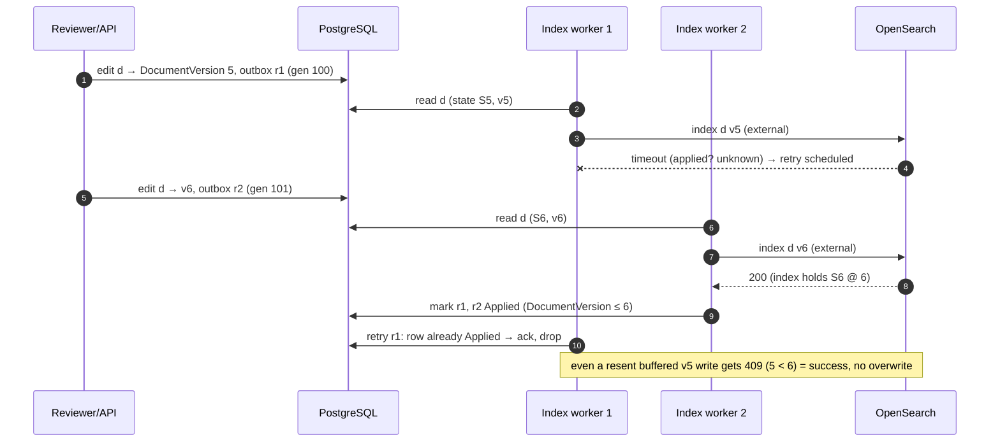
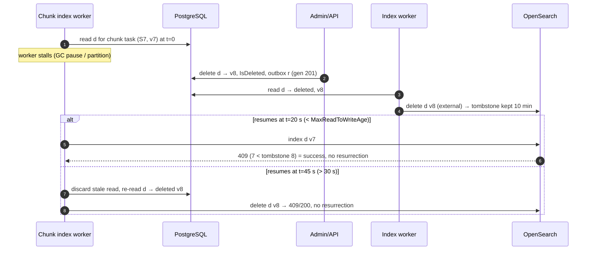

# ADR-001: PostgreSQL ↔ OpenSearch consistency, outbox dispatch and the version model

| Field | Value |
|---|---|
| **Status** | **Accepted** for §1–§7 and §9. **Proposed — pending spike** for §8 (write-primitive *optimization variant* and refresh-observer cost); the interim position in §8 is binding until `E18-T05` decides. |
| **Date** | 2026-10-02 |
| **Owner (role)** | Backend |
| **Deciders** | Lead architect; contributing: Search (OpenSearch), QA; product owner (Q-07, Q-10) |
| **Tracking issue** | #28 (plan key `E02-T02`) — written together with [ADR-010](0010-job-chunk-idempotency-semantics.md) |
| **Baseline sections** | §5, §7, §10, §21, §23, §24, §25, §26, §28 |
| **Related** | ADR-002, ADR-004b, ADR-006, ADR-010, ADR-014, ADR-019; findings A-03…A-09, A-11; Q-07, Q-10, Q-12 |

## Context

§7 mandates a transactional outbox and "monotonic versions", §21 a payload-free chunk task whose write is
"external/version-aware", §23 a `projectionVersion` field, §10 a `SearchGeneration` on snapshots and §28 a
watermark. The backend review (findings 1–7, 10, 12) and QA finding 1 show these do not compose:

- OpenSearch `version_type=external` is accepted only by full `index` (and `delete`) operations, not by `_update`
  (A-03). The baseline does not say which primitive is used under ADR-004b Candidates A–D.
- `DocumentVersion`, `projectionVersion`, `ProjectionGeneration` and `SearchGeneration` have no defined relationship
  or increment rules (A-04).
- OpenSearch keeps delete tombstones only for `index.gc_deletes` (default 60 s); a delayed write can resurrect a
  deleted document (A-05).
- §7 lists a `Payload` column while §21 is payload-free (A-06); import chunks have no snapshot (A-07).
- Dispatcher mechanics, ordering, coalescing and the security-priority path are undefined (A-08, Q-10).
- A sequence-based watermark is wrong under out-of-order commits and wrong if it ignores refresh (A-09).

The §26 gate "0 stale-version overwrites" is a correctness gate: no throughput result can compensate for missing it.

## Decision

### 1. Two kinds of search work record, one transaction each

| Record | Created by | Granularity | Content |
|---|---|---|---|
| `SearchOutbox` | interactive edits (coding, single-document admin changes) | one row per document per transaction | identifiers + versions only |
| `IndexChunkTask` | import, bulk coding, family/relationship fix-ups, reindex, repair | one row per committed job chunk | identifiers + membership reference only |

Both are **payload-free**: a worker always rebuilds the projection from current PostgreSQL state (§21 step 2). The
`Payload` column in §7 is removed (amendment B-1). Rules:

1. **R1** A work record is inserted in the *same* PostgreSQL transaction as the authoritative change. No code path
   writes to OpenSearch without one (architecture test: only `Opportunity.Search` index workers call write APIs).
2. **R2** A bulk/import chunk inserts exactly one `IndexChunkTask` and **no** `SearchOutbox` rows (§21).
3. **R3** Columns. `SearchOutbox`: `OutboxId bigint identity`, `WorkspaceId`, `DocumentId`, `DocumentVersion`
   (version written by this transaction; a hint, not a payload), `ChangeMask` (flags: `Content`, `Metadata`, `Coding`,
   `Security`, `Relationships`, `Delete`), `Lane`, `SearchGeneration`, `CommittedAt`, `Status`, `AttemptCount`,
   `AvailableAt`, `ClaimOwner`, `ClaimExpiresAt`, `DispatchedAt`, `AppliedAt`, `LastError`, `CreatedAt`.
   `IndexChunkTask`: the §21 fields plus `TaskKind` (`Import`, `BulkCoding`, `Relationship`, `Reindex`, `Repair`),
   nullable `SnapshotId`, membership reference (ADR-010 §4), `ChangeMask`, `Lane`, `SearchGeneration`,
   `CommittedAt`, `LeaseOwner`, `LeaseExpiresAt`, `LeaseToken`, `IdempotencyKey`, `AvailableAt`.
4. **R4** `SearchOutbox` is range-partitioned by `CreatedAt` (daily). A partition is dropped once every row in it is
   `Applied` and it is older than 3 days; a partition still holding non-applied rows raises an alert, never a DELETE.

### 2. Version model

| Concept | Where it lives | Scope | Meaning | Compared with |
|---|---|---|---|---|
| **`DocumentVersion`** | PostgreSQL, narrow table `DocumentProjectionState(WorkspaceId, DocumentId, DocumentVersion, IsDeleted, DeletedAt)` (final table placement: ADR-004a) | per document | Authoritative, strictly increasing `bigint`. Bumped by `+1` once per transaction that changes **any projection input** of the document, including deletion | itself only; it **is** the OpenSearch external version |
| **`projectionVersion`** | OpenSearch field on every projected document (each index under B/C, parent and child under D) | per indexed document | Denormalized copy of the `DocumentVersion` the document was built from. Invariant: `projectionVersion == _version` | the scripted guard (§3, variant only) and reconciliation |
| **`ProjectionGeneration`** | PostgreSQL `WorkspaceProjection(WorkspaceId, ProjectionGeneration, PhysicalIndex, State)` | per workspace (logical index) | Selects the physical index / mapping version. Incremented by a reindex (§7). | **never** compared with any version |
| **`SearchGeneration`** | PostgreSQL counter `WorkspaceSearchGeneration(WorkspaceId, Value)`; stamped on work records | per workspace | Commit-ordered, gap-free sequence of *work*, one value per transaction that creates search work. Drives the watermark (§6) | only with other `SearchGeneration`s and the watermark |

Relationships: `DocumentVersion` makes **writes** safe; `SearchGeneration` makes **freshness** observable;
`ProjectionGeneration` picks the **target index**. A document's version and the workspace generation advance
independently; no code compares a version with a generation. One shared `DocumentVersion` serves every index of the
projection (Candidates B/C/D): each indexed document only needs a monotonic number, and indexes not touched by a change
simply keep a lower `_version`.

**Increment rules.** The projection builder declares its *projection inputs* (PG columns/fields it reads); the
repository bumps `DocumentVersion` whenever a transaction changes one of them, and a test asserts the bump by comparing
a hash of projection inputs before/after each write path.

| Change | Bumps `DocumentVersion`? | Work record |
|---|---|---|
| Interactive coding (any coding field, security-affecting or not) | yes | `SearchOutbox` (lane per §5) |
| Bulk coding chunk (only documents whose value actually changes) | yes, once per document per chunk | 1 `IndexChunkTask` |
| Import append (new document) | initial value `1` | 1 `IndexChunkTask` (`Import`) |
| Metadata overlay / re-import | yes, only if a value actually differs | 1 `IndexChunkTask` (`Import`) |
| Extracted-text replacement, file/type/date fields, artifact changes that are projected | yes | outbox or task, by origin |
| Family re-link, duplicate-group or thread change | yes, for every document whose relationship fields change | 1 `IndexChunkTask` (`Relationship`) |
| Security restriction / ethical-wall change that alters projected `securityTags` | yes | outbox (`Security` lane) or `Relationship` task in the security-bulk lane |
| Deletion (soft) | yes; `IsDeleted = true` | outbox or task with `ChangeMask.Delete` |
| Non-projected data (audit, views, redactions unless a flag is projected, job bookkeeping) | no | none |
| Mapping change / reindex (new `ProjectionGeneration`) | **no** | `Reindex` tasks |
| Bulk document skipped under Q-07 | no | none for that document |

`DocumentId`s are never reused. The interactive API's `ETag`/`If-Match` (ADR-019 §2.7) is the `DocumentVersion`.

### 3. OpenSearch write primitive and guard

**Decision: the guard is full-document `index` with `version_type=external` and `version = DocumentVersion`, built
from authoritative PostgreSQL state (text from object storage).** Deletes are `delete` with `version_type=external`
and the deletion's `DocumentVersion`.

Rationale: (a) it is the only primitive OpenSearch version-checks natively, so correctness needs no script or
read-before-write; (b) Lucene has no in-place update — `_update` also re-indexes the whole document internally — so a
partial update saves network and source-read cost, **not** merge pressure; (c) payload-free tasks rebuild the whole
projection anyway; (d) it works unchanged for every candidate.

| Candidate (ADR-004b) | Index / update | Delete |
|---|---|---|
| A — unified | `index` full document, `external`, v = `DocumentVersion` | `delete`, `external`, v = deletion version |
| B — separate coding index | `index` content doc and/or coding doc (per `ChangeMask`), each `external` with the same v | `delete` both, `external` |
| C — hybrid | as B, per sub-index | as B |
| D — parent/child | `index` parent (content) and/or child (`_id = {documentId}#coding`, same routing), each `external` with the same v | `delete` child then parent, `external` |
| A-script (*spike variant only*, §8) | `_update` with painless guard: `if (ctx._source.projectionVersion >= params.v) { ctx.op = 'noop' } else { …; ctx._source.projectionVersion = params.v }`, **no upsert**, `retry_on_conflict = 3`; `document_missing` → fall back to full `index` | as A |

Response handling: `200/201` = applied; `409 version_conflict` = **success** (a newer or equal version is already
there); `429/5xx` = transient (re-read and retry, §4 R3); `400 mapper_parsing_exception` = permanent item failure.
Explicit `Repair` tasks (reconciliation) may use `external_gte` to rewrite an equal version; nothing else may.

**Read-consistency rule.** A worker reads the projection inputs **and** `DocumentVersion` of each document in one
PostgreSQL snapshot (single statement or `REPEATABLE READ` transaction), so the payload written is exactly the state at
the version written. Workers ignore the version in the message for writing; they always write *current* state at
*current* version.

### 4. Deletes and tombstones

1. **R1 Missing or deleted means delete.** If the PG read finds `IsDeleted = true`, the worker issues an external
   `delete` with that version. If the row is gone entirely (hard-purged), it issues an unconditional `delete` — safe
   because `DocumentId`s are never reused. A missing row is never a skip.
2. **R2 `index.gc_deletes = 10m`** on every projection index (ADR-006 template), instead of the 60 s default.
3. **R3 Read-to-write age bound.** A worker MUST NOT send a write built from a PG read older than
   `MaxReadToWriteAge = 30 s` (monotonic clock). Retries of failed bulk items re-read PG. Client bulk timeout is 60 s.
   The margin `gc_deletes − MaxReadToWriteAge − bulk timeout` (≈ 8.5 min) covers server-side write-queue time.
4. **R4 PG tombstones.** Soft-deleted `DocumentProjectionState` rows are kept ≥ 24 h and until the delete is applied
   to every active `ProjectionGeneration`; only then may a purge remove them.
5. **R5 Workspace fencing.** Workspace deletion sets `Workspace.Status = Deleting` first; every worker checks it at
   claim and before each OpenSearch request, and drops the work. Indexes/partitions are dropped only after all leases
   of the workspace have expired (sequence owned by ADR-014 / `E20-T02`).

### 5. Ordering, coalescing and priority lanes

1. **No ordering guarantee.** Per-document message ordering is **neither provided nor needed** (A-08). Correctness rests
   only on §3 and §4. Single-active-consumer queues or per-document partitioning "for ordering" are prohibited.
2. **Coalescing happens in the index worker, implicitly.** After a successful write of document *d* at version *v*,
   the worker marks every `SearchOutbox` row of *d* with `DocumentVersion ≤ v` as `Applied` in one statement, whatever
   their status. Rows coalesced before dispatch are never published; their late duplicates are acked and dropped. The
   dispatcher does no coalescing.
3. **Lanes (Q-10).** Separate RabbitMQ quorum queues with dedicated consumer pools, not `x-max-priority`:

| Lane | Work | Consumer capacity |
|---|---|---|
| `L0 security` | `SearchOutbox` rows with `ChangeMask.Security` | reserved pool, never shared |
| `L1 interactive` | other `SearchOutbox` rows | reserved pool |
| `L2 security-bulk` | `IndexChunkTask`s whose job writes a security-affecting field | shared bulk pool, strict preference over L3 |
| `L3 bulk` | all other `IndexChunkTask`s | shared bulk pool |

4. **Q-10 enforcement.** SLO: security-projection lag ≤ 5 s p95, measured per security work record as
   *(first refresh observation after `AppliedAt`) − `CommittedAt`* (metric `security_projection_lag_seconds`). L0 has
   reserved capacity so bulk load cannot queue ahead of it. Bulk jobs writing a security-affecting field use ≤ 500-document
   chunks and are throttled so their commit rate does not exceed the measured L2 indexing rate (ADR-010 §6), which keeps
   per-chunk lag bounded. Access itself never waits for the projection (§24, Q-12 post-filter).

### 6. Outbox dispatcher

1. **Claiming.** `Opportunity.Worker.Dispatcher` runs N instances, no leader. Each loop claims a batch in a short
   transaction:
   `UPDATE … SET Status='Claimed', ClaimOwner=@me, ClaimExpiresAt=now()+'30 s' WHERE id IN (SELECT id … WHERE
   (Status='Pending' OR (Status='Claimed' AND ClaimExpiresAt < now())) AND AvailableAt <= now()
   ORDER BY Lane, SearchGeneration LIMIT 500 FOR UPDATE SKIP LOCKED)`. `IndexChunkTask` and `JobChunk` rows are
   claimed the same way through `ClaimOwner`/`ClaimExpiresAt` columns (their `Status` stays `Pending`/`RetryWait`).
   It publishes with **publisher confirms**, then sets `Status='Dispatched', DispatchedAt=now()` for confirmed rows.
   A crash between confirm and mark leaves the claim to expire and the row is re-published: **at-least-once**.
2. **Wake-up.** Interactive outbox inserts issue `pg_notify('search_outbox', '<lane>')` in the transaction; dispatchers
   `LISTEN` and claim immediately. Fallback polling: 1 s for `SearchOutbox` (250 ms while the LISTEN connection is
   unhealthy) and 500 ms for `IndexChunkTask` (which never NOTIFYs, to keep NOTIFY's commit-time lock off bulk
   commits).
3. **Redispatch sweeper.** A `Dispatched` outbox row not `Applied` within 60 s returns to `Pending` (duplicates are
   harmless). Chunk-task redispatch follows lease expiry (ADR-010).
4. **Retry state lives in PostgreSQL** (`AttemptCount`, `AvailableAt`); workers ack every message after recording the
   outcome. Outbox rows: max 10 attempts, backoff 0.5 s ×2ⁿ capped at 30 s, then `Failed` + alert. Dead-lettering and
   replay follow ADR-010 §7.

### 7. Search generation, refresh-aware watermark and reindex

1. **Commit-ordered generation (late-lock counter).** The **last** statement of every transaction that creates search
   work is
   `UPDATE WorkspaceSearchGeneration SET Value = Value + 1 WHERE WorkspaceId = @ws RETURNING Value, clock_timestamp()`,
   whose result is stamped on the work record(s) as `SearchGeneration` and `CommittedAt`. Because the row lock is held
   until commit, generation *g+1* cannot commit before *g*, and a rollback undoes the increment: the sequence is
   gap-free and commit-ordered per workspace while the lock is held only for the final insert and the commit.
   Interactive and bulk work share this one sequence.
2. **Applied watermark.** In one snapshot: `A = min(SearchGeneration of non-Applied rows in SearchOutbox ∪
   IndexChunkTask) − 1`, or the counter value if none are pending. `Failed` rows hold `A` back (the UI shows *Delayed*).
3. **Visible watermark (refresh-aware).** One ticker per physical index (advisory lock, in the dispatcher host), every
   1 s: compute `A(t₀)` for each workspace on the index, call `POST /{index}/_refresh` (broadcast to all shard copies),
   and on `_shards.failed == 0` set `indexedThroughGeneration := max(current, A(t₀))`. The watermark never moves
   backwards and is never set from an ack alone.
4. **Exposure.** `indexedThroughGeneration`, `jobGeneration` (= `SearchGeneration` of a job's last chunk task) and
   `isProjectionCurrent` are returned by the API (`E07-T08`); lag gauge `search.index_lag_seconds = now −
   CommittedAt(oldest work record above the watermark)`, sampled each second.
5. **Reindex / alias switch.** A reindex registers `ProjectionGeneration` *p+1* as `Building`; from then on workers
   write every message to all active generations (resolved from PG per message, cache ≤ 5 s) before marking it
   `Applied`. `Reindex` tasks start after cache TTL + `MaxReadToWriteAge`, enumerate PG key ranges and write to *p+1*
   only; they carry no `SearchGeneration`. The alias switches when all `Reindex` tasks are `Applied` and validation
   passes; the generation sequence and the watermark continue unchanged across the switch. The old index is kept
   ≥ the maximum PIT age (ADR-002) before deletion.

**Implementation (E07-T08, #70).** The visible watermark lives in `workspace_search_watermark` (V0030), apart from
the counter row so the ticker never waits on a committing transaction's counter lock. `SearchWatermarkAdvancer` (in
`Opportunity.Search`, run every `Search:Watermark:Interval` = 1 s by the dispatcher host) reads counter, visible
watermark, A(t₀) and the oldest unreflected `CommittedAt` in one REPEATABLE READ snapshot per workspace; for the
workspaces with A(t₀) above their watermark it sends one `POST /{index}/_refresh` per physical index (the read alias
and every write target, so a rebuild target is refreshed too) and raises the watermark with `GREATEST` only for
workspaces whose indexes all answered `_shards.failed == 0`. Several dispatcher replicas may each run a ticker: this
is safe (each A(t₀) precedes its own refresh; the store takes the maximum) and only adds refreshes; the per-index
advisory lock is an optimization left to `E18-T04` (S4). Exposure: `GET …/search-freshness`
(`state` current/updating/delayed with delayed = oldest unreflected work older than 2 min, `indexedThroughGeneration`,
`latestGeneration`, `pendingChanges` = latest − indexed, `lagSeconds`), the same fields on every search page's
`freshness` (page `servedGeneration`/`current` are the watermark the page's reader was opened at), and on jobs
`searchable.jobGeneration`/`indexedThroughGeneration` with `state = current` once the job is finished and the
watermark ≥ `jobGeneration`. Gauges per workspace (bounded), sampled each tick: `opportunity.search.generation.committed`,
`.indexed`, `.lag` (`search_generation_lag`) and `opportunity.search.index_lag`.
**Reindex / alias switch obligations for `E07-T11` (#73):** Reindex tasks carry no generation, so neither they nor a
backfill move the watermark; dual writes are refreshed by the ticker because every write target is refreshed;
`IIndexManager.CompleteRebuildAsync` refreshes the target before the alias switch, so everything the watermark covered
on the old index is already searchable on the new one when reads move. The generation sequence and the watermark row are
per workspace, not per index, and are not reset by a switch or a move between shared and dedicated placement.

### 8. Interim position and what the ADR-004b spike must measure (*Proposed — pending spike*)

Interim: full-document external `index` everywhere (§3), explicit-refresh ticker (§7.3). `E18-T04` must measure, per
candidate, on the frozen 1M profile:

| # | Measurement | Decides | Fallback if it fails |
|---|---|---|---|
| S1 | Full `index` vs A-script `_update`: bulk docs/s, coding→searchable p95, merge MB/s, disk amplification, PG + object-store read cost | Promote A-script only on a Q-04 *material advantage* (≥ 1.5× bulk throughput or ≥ 20% p95) **and** 0 stale overwrites | Keep full `index`; merge pressure is then a Candidate-A gate result, not a guard change |
| S2 | Stale overwrites via shadow ledger (`E17-T07`) under reorder/duplicate/delay faults, with `gc_deletes` lowered to 10 s to stress tombstones | §26 correctness gate | Any non-zero count disqualifies the variant |
| S3 | Heap/version-map cost of `gc_deletes = 10m` under a 1M-document delete storm | R2 value | Lower to 5 m only if `MaxReadToWriteAge` and timeouts are lowered proportionally |
| S4 | Explicit-refresh ticker overhead vs `refresh_interval` tuning variants | §7.3 | If > 5% bulk throughput loss: passive observation — advance only after each shard copy's refresh count (`_stats/refresh`) increased **twice** after t₀ |
| S5 | `security_projection_lag_seconds` p95 under sustained bulk load, incl. security-field placement under B/C/D | Q-10 ≤ 5 s | Larger L0 pool; security fields co-located with the filter index (ADR-004b criterion) |
| S6 | NOTIFY commit overhead at peak interactive commit rate | §6.2 | Batch NOTIFY via statement trigger, or polling at 100 ms |
| S7 | Worker-side coalescing ratio with 100 reviewers | §5.2 | none needed (informational) |

If segment replication is enabled (ADR-006), the spike must also verify that the explicit refresh makes replicas
searchable before the watermark advances.

### 9. Invariant: 0 stale overwrites

For each indexed document, every accepted write carries `(v, P(v))` where `P(v)` is the PG state at version *v*
(read-consistency rule). OpenSearch accepts a write only if *v* exceeds the stored `_version` (or tombstone), so the
stored projection is always `P(max accepted v)`. A delete tombstone outlives every in-flight read (§4 R2–R3), and any
read after the delete sees the PG tombstone (§4 R1). Hence no older state can replace a newer one.

## Consequences

- **Positive:** one write primitive and one version for all four ADR-004b candidates; correctness needs no ordering,
  no locks in OpenSearch and no scripts; coalescing falls out of payload-free reads; the watermark is provably
  conservative; Q-10 has a mechanism and a metric.
- **Negative / costs:** Candidate A re-sends whole documents (up to the Q-29 cap) on every coding change — this is now
  an explicit ADR-004b measurement. The late-lock counter serializes the *commit* of search-work transactions per
  workspace (held for one insert + commit). `gc_deletes = 10m` costs heap for tombstones. Four queues and a ticker
  add operational surface.
- **Follow-up work:** `E06-T03` (#58) tables/partitions; `E06-T04` (#59) dispatcher; `E07-T03` (#65) / `E07-T04` (#66)
  workers; `E07-T08` (#70) watermark; `E07-T11` (#73) reindex; `E17-T06` (#144) black-box probe; `E05-T06` (#51) security lane; `E18-T04` (#151) S1–S7;
  `E17-T07` (#145) ledger oracle; ADR-006 sets `gc_deletes` in the template.
- **Verification:** property test (watermark never passes an unapplied or unrefreshed generation under concurrent
  out-of-order commits); 10K randomized reorder/duplicate/delay runs with 0 stale overwrites; delete-then-delayed-retry
  fault test with stalls of 20 s and 45 s; repository test that every projection-input write bumps `DocumentVersion`;
  architecture test that only index workers call OpenSearch write APIs.

## Alternatives considered

| Option | Why not chosen |
|---|---|
| `_update` guarded by `if_seq_no`/`if_primary_term` | Needs a GET before every write (2 round-trips), still needs a version comparison, and fails on concurrent writers instead of converging |
| Painless-guarded `_update` as the default | Script cost on every write and an extra failure class (`document_missing`); kept as spike variant A-script only |
| Separate counters per index (`ContentVersion`, `CodingVersion`) | A shared monotonic `DocumentVersion` is sufficient per index and avoids two bump rules |
| `DocumentVersion` = workspace generation | Would make every document write take the workspace counter lock for the whole transaction |
| Watermark from a plain sequence | Sequences are allocated before commit; out-of-order commits make the watermark skip unapplied work |
| Watermark advancing on bulk ack | Acked writes are invisible until refresh; the §26 lag gate would pass falsely (QA finding 1) |
| Logical replication / Debezium instead of an outbox | Extra infrastructure, and it loses the explicit chunk-level unit §21 requires |
| Dispatcher-side coalescing | Requires per-document grouping in the claim query; worker-side "applied through version" is simpler and exact |
| Per-document ordered queues | Throughput and hot-spot costs with no correctness benefit given §3 |

## Baseline amendments

All *Proposed* until lead-architect and product-owner sign-off; the baseline file is not edited by this ADR.

| ID | Amendment | Finding |
|---|---|---|
| B-1 | §7: remove `Payload`; `SearchOutbox` columns per §1 R3; interactive rows are payload-free | A-06 |
| B-2 | §21: `IndexChunkTask` gains `TaskKind`, nullable `SnapshotId`, membership reference, `ChangeMask`, `Lane`, `SearchGeneration`, `CommittedAt`, lease fields; step 1 resolves membership per ADR-010 §4 | A-07 |
| B-3 | §21 step 5 / §25: write primitive = full-document external `index`/`delete` (§3); A-script is a spike variant | A-03 |
| B-4 | §5/§7/§10/§23/§28: version model of §2 (four concepts, increment rules, no cross-comparison) | A-04 |
| B-5 | §15/§21: missing row = delete; `gc_deletes = 10m`; read-to-write age bound; workspace fencing | A-05 |
| B-6 | §7/§11: per-document ordering is not guaranteed and not required | A-08 |
| B-7 | §28: commit-ordered generation; watermark advances only after an observed refresh; continuous across alias switch | A-09 |
| B-8 | §24.3: security lane and SLO ≤ 5 s p95 security-projection lag (Q-10) | A-11, Q-10 |

## Links

- Baseline: [§5, §7, §10, §21, §23–§26, §28](../architecture/architecture-baseline.md)
- Review findings: [review-findings.md](../plan/review-findings.md) A-03…A-09, A-11, §1.6–§1.10;
  [backend review](../plan/reviews/backend.md) findings 1–7, 10, 12; [QA review](../plan/reviews/qa-perf.md) finding 1
- Decisions: [decisions.md](../plan/decisions.md) Q-04, Q-07, Q-10, Q-12, Q-29
- Companion ADRs: [ADR-010](0010-job-chunk-idempotency-semantics.md), [ADR-002](0002-bulk-snapshot-semantics.md),
  [ADR-019](0019-layering-and-api-conventions.md)
