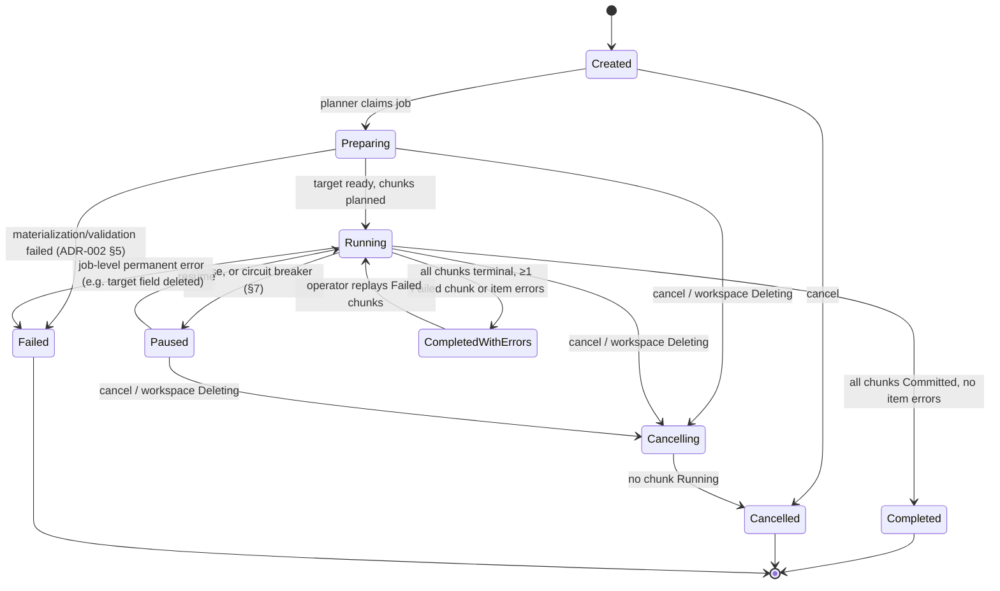
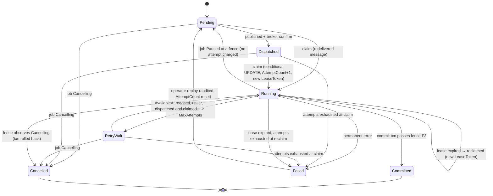

# ADR-010: Job, chunk and idempotency semantics

| Field | Value |
|---|---|
| **Status** | **Accepted.** The numeric chunk bounds in §6 are initial values, tuned by `E18-T03`/`E18-T04` without a new ADR (dated note in place). |
| **Date** | 2026-10-02 |
| **Owner (role)** | Backend |
| **Deciders** | Lead architect; contributing: Search (OpenSearch), QA, Security & Compliance; product owner (Q-07, Q-15, Q-34) |
| **Tracking issue** | #28 (plan key `E02-T02`) — written together with [ADR-001](0001-search-consistency-outbox-and-version-model.md) |
| **Baseline sections** | §2.4, §11, §12, §21, §27, §32 |
| **Related** | ADR-001, ADR-002, ADR-004a, ADR-014, ADR-019 §3; findings A-07, §2.1–§2.5; Q-07, Q-14, Q-15, Q-34 |

## Context

§11 says "RabbitMQ transports work; PostgreSQL owns job state" and lists `Job`/`JobChunk` fields, but defines no
statuses, transitions, cancellation, leases, idempotency-key rule, chunk bounds or dead-letter semantics (backend
findings 8–11). §21 step 1 "resolve the chunk's exact document IDs" has no meaning for import, where the chunk creates
the documents (A-07). Q-07 requires bulk jobs to skip documents edited after the job started; Q-15 requires per-chunk
re-authorization of exports; Q-34 rules out undo. The canonical failure is a worker crash after the PG commit but
before the broker ack; the design must make it harmless.

## Decision

### 1. Entities

- **`Job`**: `JobId`, `WorkspaceId`, `JobType`, `Status`, `StatusReason`, `TargetSnapshotId` (nullable),
  `ImportBatchId` (nullable), `Parameters` (JSONB, validated), `InitiatedBy`, `ClientIdempotencyKey` (from the HTTP
  `Idempotency-Key`, ADR-019 §2.6), `CorrelationId`, `JobGeneration` (nullable until the last chunk commits),
  progress counters (`ChunksTotal/Committed/Failed/Cancelled`, `ItemsApplied/Unchanged/SkippedConcurrentEdit/
  ExcludedNoAccess/Failed`, `IndexTasksTotal/Applied`), timestamps.
- **`JobChunk`**: `ChunkId`, `WorkspaceId`, `JobId`, `ChunkSequence` (1…n, dense), membership reference (§4),
  `Status`, `AttemptCount`, `MaxAttempts`, `AvailableAt`, `IdempotencyKey`, `LeaseOwner`, `LeaseExpiresAt`,
  `LeaseToken` (bigint fencing token), `LastError`, `ErrorClass`, `ReplayCount`, timestamps.
- **`JobChunkItemResult`**: per-item outcomes that are not plain success (Q-07 skips, Q-15 exclusions, item errors);
  source of the job's downloadable reports.

All chunks are planned up-front in `Preparing` (10M documents / 1,000 = 10K rows). Counters are updated in the chunk's
commit transaction (penultimate statement, before ADR-001's generation counter), so progress is O(1).

### 2. State machines

Every transition is one conditional `UPDATE … WHERE Status IN (…allowed sources…)`; a zero-row result means the
transition is illegal or already happened. `Failed` is terminal for the job's completion but replayable.

The dispatcher's short publish claim (ADR-001 §6.1) is held in `ClaimOwner`/`ClaimExpiresAt` columns and is not a
`JobChunk` status. **`IndexChunkTask`** uses the same pattern: `Pending → Dispatched → Running (lease) → Applied`, plus
`RetryWait` and `Failed`. **`SearchOutbox`** rows go `Pending → Claimed → Dispatched → Applied` (or straight to
`Applied` when coalesced), plus `Failed`. **Neither is ever cancelled**: a committed PG change must reach the index, so
cancelling or pausing a job never touches its index tasks.

**Fence points.** A chunk executes work only while the job is `Running` and the workspace is `Active`:

| Fence | Where | On failure |
|---|---|---|
| F1 | claim statement joins `Job.Status = 'Running'` and `Workspace.Status = 'Active'` | `Paused` → leave `Pending`; `Cancelling` → `Cancelled`; ack message |
| F2 | before each external side effect batch (object-store writes for export/production/import uploads, each OpenSearch request) | stop; roll back the PG transaction if one is open |
| F3 | inside the commit transaction: `SELECT Status FROM Job … FOR SHARE`, workspace status, and `UPDATE JobChunk SET Status='Committed' WHERE ChunkId=@c AND LeaseToken=@t AND Status='Running'` | zero rows or not `Running` → roll back; the chunk did not happen |

Cancel, pause and workspace deletion lock the `Job` row `FOR UPDATE`, so they serialize with F3: a chunk commits
if and only if the job was still `Running` at its commit. Cancellation keeps already committed chunks (no undo, Q-34);
`Cancelling → Cancelled` waits for running chunks to reach a fence (bounded by the lease, §3).

### 3. Leases

1. Claim: `UPDATE JobChunk SET Status='Running', LeaseOwner=@worker, LeaseExpiresAt=now()+'60 s',
   LeaseToken=LeaseToken+1, AttemptCount=AttemptCount+1 WHERE ChunkId=@c AND (Status IN ('Pending','Dispatched',
   'RetryWait') OR (Status='Running' AND LeaseExpiresAt < now())) AND AttemptCount < MaxAttempts RETURNING
   LeaseToken`. If `AttemptCount ≥ MaxAttempts` a separate statement moves the chunk to `Failed` (this ends crash
   loops even when the process dies before recording an error).
2. Heartbeat every 20 s extends the lease only while `LeaseToken` matches; a worker that loses its lease stops at the
   next fence. Maximum chunk runtime 15 min, enforced by a worker watchdog.
3. A lease sweeper (every 30 s, in the dispatcher host) returns `Running` chunks whose lease expired more than 10 s ago
   to `Pending` for re-dispatch. An early redelivery that finds a live lease is acked and dropped; the sweeper covers it.

### 4. Chunk membership for every job type (§12 vs §21)

`JobChunk` and `IndexChunkTask` carry one membership reference; `SnapshotId` is nullable.

| Kind | Used by | Reference | Resolution (§21 step 1) |
|---|---|---|---|
| `SnapshotRange` | bulk coding, apply-to-family > 1,000 (Q-14), export, production, review batch | `SnapshotId`, `OrdinalFrom`, `OrdinalTo` | read member pages of the materialized snapshot (ADR-002 §6) |
| `ImportRows` | import (append, overlay, append/overlay) | `ImportBatchId`, `RowFrom`, `RowTo` | `ImportBatchMember(WorkspaceId, ImportBatchId, RowNo, DocumentId)` rows written by the import chunk's own transaction |
| `DocumentKeyRange` | reindex | `ProjectionGeneration`, `DocumentIdFrom`, `DocumentIdTo` | current PG rows in the key range at execution; later changes are dual-written (ADR-001 §7.5) |
| `ExplicitIds` | relationship fix-ups, repair | `DocumentIds` array, ≤ 1,000 | as listed (identifiers only, still payload-free) |

The import chunk *creates* its membership: the import worker parses rows `RowFrom…RowTo`, inserts/overlays documents,
writes `ImportBatchMember` rows and the `IndexChunkTask(Import, ImportRows …)` in one transaction. Rows that fail
validation get no member row and an item result. The index task resolves exactly the documents the chunk committed.

### 5. Idempotency

1. **Key formula.** `IdempotencyKey = lowercase-hex(SHA-256(UTF-8("v1|" + WorkspaceId + "|" + JobId + "|" +
   ChunkSequence + "|" + OperationKind + "|" + ProjectionGeneration)))`, IDs in canonical lowercase form, numbers in
   invariant decimal. `OperationKind` ∈ {`ImportChunk`, `BulkCodingChunk`, `RelationshipChunk`, `IndexChunk`,
   `ReindexChunk`, `ExportChunk`, `ProductionChunk`, `RenderChunk`}. `ProjectionGeneration` is the target generation
   for `ReindexChunk` and `0` for work that targets all active generations or no index. Interactive outbox messages
   use `SHA-256("v1|" + WorkspaceId + "|outbox|" + OutboxId)`. Unique index `(WorkspaceId, IdempotencyKey)` on
   `JobChunk` and `IndexChunkTask`.
2. **Identifiers.** `MessageId` is a fresh UUIDv7 per publish attempt (tracing); `IdempotencyKey` is stable across
   re-publish; envelope `attempt` = the row's `AttemptCount`. `ClientIdempotencyKey` deduplicates job *creation*
   (ADR-019) and is unrelated to chunk keys.
3. **Consumer dedupe = conditional transition**, not an inbox table: the claim (§3.1) is the inbox. A message whose
   claim returns zero rows is acked and dropped. PG-mutating chunks therefore take effect exactly once (F3 fencing
   token); OpenSearch-writing tasks may execute more than once, which ADR-001 makes harmless.
4. **Semantic idempotency.** Bulk operations are state-based ("ensure tag X present", "set field F = v"), never
   deltas. A `CodingEvent` is written only when a value actually changes; a unique index on
   `(WorkspaceId, JobId, DocumentId, FieldId)` for job-originated events is defence in depth against double provenance.

### 6. Chunk bounds, throttling and backpressure (initial values)

| Work | Documents per chunk | Byte / other bound | Tuned by |
|---|---|---|---|
| Bulk coding | 1,000 (500 if any security-affecting field) | target transaction ≤ 2 s | `E18-T03` |
| Import | 500 rows | ≤ 512 MB referenced natives+images, ≤ 64 MB extracted text | `E18-T03`, `E08-T03` |
| Relationship fix-up | 1,000 | — | `E09-T01` |
| Reindex | 2,000 (key range) | — | `E07-T11` |
| Export | 250 | ≤ 2 GB output, ≤ 5,000 pages | `E12-T01` |
| Production | 100 | ≤ 2,000 pages | `E12-T02` |
| OpenSearch `_bulk` sub-request (index worker, independent of chunk size) | ≤ 500 actions | ≤ 10 MB body (limit `http.max_content_length` = 100 MB); a larger single document is sent alone; > 90 MB serialized = permanent item failure | `E18-T04` |

Concurrency defaults: ≤ 4 running chunks per job, ≤ 8 bulk chunks per workspace. **Index backpressure:** the dispatcher
stops dispatching new chunks of a job while more than 50 of its `IndexChunkTask`s are un-applied (keeps the §26 lag
gate reachable). **Security throttle (Q-10):** a job writing a security-affecting field may have at most 4 un-applied
`IndexChunkTask`s, so its commit rate follows the `L2 security-bulk` indexing rate. Bulk updates lock rows in
`DocumentId` order to avoid deadlocks with each other; interactive edits wait at most one chunk transaction.

### 7. Retry, poison handling, dead-letter and replay

| Error class | Examples | Action |
|---|---|---|
| Transient | timeouts, PG serialization/deadlock, OpenSearch 429/503, broker/store unavailable | `RetryWait`, backoff 5 s × 2ⁿ ± 20% jitter, cap 5 min; `MaxAttempts = 5` |
| Permanent | validation, `mapper_parsing_exception`, unsupported schema major, envelope/PG mismatch, job-level invalid parameters | `Failed` immediately (`ErrorClass`, `LastError`) |
| Item-level | one document invalid inside a chunk, Q-07 skip, Q-15 exclusion | `JobChunkItemResult`; the chunk still commits |
| Success no-op | OpenSearch `409 version_conflict` | counts as applied (ADR-001 §3) |

1. **PostgreSQL is the retry and failure ledger.** Workers record the outcome in PG and then ack; they never `nack`
   with requeue. Transport-level retry (`E06-T01` TTL/DLX queues) is used only when the PG row cannot even be loaded.
2. **Poison messages.** Quorum queues set `x-delivery-limit = 5`; a message that crashes the consumer repeatedly is
   dead-lettered. Independently, the claim-time attempt check (§3.1) moves the PG row to `Failed`.
3. **DLQ = diagnostics only.** Each queue has a `*.dlq` (max-length 100K, TTL 14 days). A dead-letter recorder copies
   headers, `x-death` and error into PG `DeadLetterRecord` for the admin UI. DLQ messages are **never** re-published.
4. **Replay = reset PG state.** Admin-only, audited API (`E06-T06`): `Failed → Pending`, `AttemptCount = 0`,
   `ReplayCount + 1`; the dispatcher re-publishes. Replay is per chunk/task/outbox row or "all failed of job X".
5. **Circuit breaker.** 5 consecutive chunk failures of the same `ErrorClass`, or > 10% failed chunks once ≥ 20 have
   finished, moves the job to `Paused` with a reason; the operator resumes or cancels.
6. **Alerts:** DLQ depth > 0, any `Failed` row, chunk `Running` > 15 min, oldest `Pending` age, watermark stuck.

### 8. Q-07 enforcement — bulk skips documents edited after job start

1. Every materialized snapshot member stores `BaselineVersion` = its `DocumentVersion` read in the snapshot's freeze
   transaction (ADR-002 §5, one consistent PG snapshot); that read is the job's start point for the document.
2. Each coding current-state value carries `ChangedAtVersion` (the `DocumentVersion` produced by the change) and
   `ChangedByJobId` (null for interactive). Physical placement is ADR-004a's; the attributes are mandatory.
3. In the chunk transaction, after `SELECT … FOR UPDATE` of the members (ordered by `DocumentId`), the worker skips
   field *f* of document *d* iff `f.ChangedAtVersion > member.BaselineVersion AND f.ChangedByJobId IS DISTINCT FROM
   @thisJob`. Deleted documents are skipped likewise.
4. A skip writes a `CodingEvent` of kind `BulkSkippedConcurrentEdit` (no value change, no version bump) and a
   `JobChunkItemResult`. The job result reports `ItemsSkippedConcurrentEdit` and a downloadable CSV (admin).
5. Edits committed after the chunk commits simply win later (they are newer); no extra rule is needed.

### 9. Envelope trust and execution identity

Workers load the `JobChunk`/task by ID, then `Job`, and take `WorkspaceId`, `InitiatedBy`, `JobType` and parameters
from PostgreSQL only; they set the RLS workspace context from the row. If the envelope `workspaceId` differs, the
message is a permanent failure (`EnvelopeMismatch`) and a security audit event; no work runs. Export and production
chunks re-authorize every member against current PG security state for `InitiatedBy` and record exclusions (Q-15).

### 10. Two-phase progress

`Job.Status` describes the authoritative (PG) phase. The indexing phase is derived: `IndexState = Current` when
`IndexTasksApplied = IndexTasksTotal` and the watermark ≥ `JobGeneration` (ADR-001 §7), otherwise `Indexing`. The job
API returns both, so the UI can show "committed" and "search updating" separately (§28).

## Consequences

- **Positive:** crash-after-commit, duplicates and redelivery are harmless by construction; one claim statement is
  both lease and inbox; cancel/pause have exact semantics; Q-07 is enforced precisely, per field, without a
  workspace-wide lock; failures are inspected and replayed from PostgreSQL, which stays the source of truth.
- **Negative / costs:** every chunk commit updates the `Job` row (serializes commits within one job; bounded by
  ≤ 4 concurrent chunks); per-field `ChangedAtVersion`/`ChangedByJobId` adds width to coding storage; per-item results
  can be large for jobs with many skips.
- **Follow-up work:** `E06-T02` (#57) state machine and leases; `E06-T05` (#60) consumer framework; `E06-T06` (#61)
  replay/DLQ; `E08-T03` (#77) import membership; `E10-T04` (#92) bulk coding and Q-07; `E12-T01` (#100) Q-15;
  `E18-T03` (#150) chunk sizing; `E18-T01` (#148) fault matrix.
- **Verification:** unit tests over the full transition matrix (illegal transitions rejected); fault suite delivering
  each message 1–3 times with random crashes before/after commit — final state identical to single delivery; worker
  kill mid-chunk → lease expiry → exactly one `Committed`; Q-07 test with an interactive edit between snapshot and
  chunk commit; test that envelope/PG workspace mismatch performs no work.

## Alternatives considered

| Option | Why not chosen |
|---|---|
| Inbox table keyed by `MessageId` | `MessageId` changes per publish; the conditional chunk transition already deduplicates and fences |
| RabbitMQ TTL/DLX as the retry ledger | Splits job state between broker and PG, contrary to §11; attempts would be invisible to the job API |
| Shovelling DLQ messages back for replay | DLQ copies can be stale or duplicated; replay must start from authoritative PG state |
| Last-commit-wins for bulk vs interactive | Overruled by Q-07 |
| Timestamp comparison for Q-07 | Clock and commit-order skew; versions are exact and local to the document |
| Leader-elected single job scheduler | Unnecessary with `SKIP LOCKED` claims and leases; a single point of failure |
| Cancelling index tasks of a cancelled job | Would leave committed PG changes unindexed |

## Baseline amendments

All *Proposed* until lead-architect and product-owner sign-off; the baseline file is not edited by this ADR.

| ID | Amendment | Finding |
|---|---|---|
| B-1 | §11: `Job`/`JobChunk` fields, statuses and transitions of §1–§2; leases and fencing token | §2.2 |
| B-2 | §11/§2.4: idempotency key formula and conditional-transition dedupe (§5) | §2.1 |
| B-3 | §11/§7: DLQ is diagnostics only; replay resets PG state (§7) | §2.3 |
| B-4 | §12/§21: chunk membership kinds of §4; `ImportBatchMember` | A-07 |
| B-5 | §11: chunks bounded by count **and** bytes (§6) | §1.9 |
| B-6 | §11/§24: workers resolve workspace and actor from PG, never from the envelope | §2.5 |

## Links

- Baseline: [§2.4, §11, §12, §21, §27, §32](../architecture/architecture-baseline.md)
- Review findings: [review-findings.md](../plan/review-findings.md) A-07, §2.1–§2.6;
  [backend review](../plan/reviews/backend.md) findings 4, 8–11
- Decisions: [decisions.md](../plan/decisions.md) Q-07, Q-10, Q-14, Q-15, Q-29, Q-34
- Companion ADRs: [ADR-001](0001-search-consistency-outbox-and-version-model.md),
  [ADR-002](0002-bulk-snapshot-semantics.md), [ADR-019](0019-layering-and-api-conventions.md)
