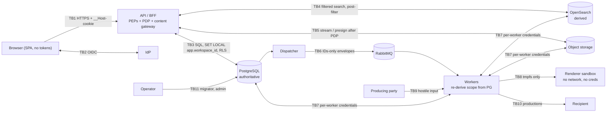

# ADR-015: Security architecture and trust boundaries

| Field | Value |
|---|---|
| **Status** | Proposed. Interim position: rules D1–D17 are binding for new code now. Acceptance waits on product-owner sign-off of AR-01–AR-03 and the confirmations in *Open confirmations* |
| **Date** | 2026-10-02 |
| **Owner (role)** | Security & Compliance |
| **Deciders** | Lead architect, product owner (Q-01, Q-11–Q-16 affected); contributing: Backend, Data (PostgreSQL), Search (OpenSearch), DevOps / SRE |
| **Tracking issue** | #34 (`E02-T08`) |
| **Baseline sections** | [§2.3](../architecture/architecture-baseline.md#2-core-principles), [§3](../architecture/architecture-baseline.md#3-high-level-architecture), [§11](../architecture/architecture-baseline.md#11-rabbitmq-jobs-and-messaging), [§12](../architecture/architecture-baseline.md#12-minimal-ingestion), [§13](../architecture/architecture-baseline.md#13-rendering-viewer-and-redactions), [§15](../architecture/architecture-baseline.md#15-security-audit-and-lifecycle), [§16](../architecture/architecture-baseline.md#16-cache-and-deployment-profiles), [§23](../architecture/architecture-baseline.md#23-search-projection-baseline), [§24](../architecture/architecture-baseline.md#24-security-consistency-rules) |
| **Related** | [Threat model](../security/threat-model.md); ADR-001/010 (#28), ADR-011 (#32), ADR-013 (#33), [ADR-019](0019-layering-and-api-conventions.md); review findings A-02, A-10, A-11, A-12, A-15; decisions Q-01, Q-10, Q-11, Q-12, Q-13, Q-14, Q-15, Q-16, Q-18, Q-23, Q-31 |

## Context

The baseline names the security goals (workspace RBAC, document restrictions, ethical walls, "search is never the
final authorization decision", TLS, encryption at rest), but it has no threat model, no authorization model, no
database-enforced isolation, no worker trust rules and no secure-SDLC requirements (security review findings 1–14,
review-findings §5–§6). The product owner has since decided:

- **Q-01:** self-hosted, one organization per installation, many workspaces with mandatory isolation. Lite is
  evaluation-only. Full is the production profile with TLS everywhere, PostgreSQL RLS, the OpenSearch security
  plugin, sandboxed render workers and malware scanning on by default.
- **Q-11:** document-level restriction classes (privilege, confidentiality, wall membership) are in the MVP.
  Restricted documents are invisible to unauthorized users everywhere.
- **Q-12:** every page of search results is post-filtered against authoritative PostgreSQL state before it is
  returned.
- **Q-13:** full ethical walls for users and IdP groups. Walled documents are hidden including counts and facets.
  Admins can be walled. Emergency access uses an audited break-glass role.
- **Q-15:** exports re-check access at execution and exclude denied documents with a report.
- **Q-16:** full executed search text is stored in audit and visible only to admin and auditor roles.
- **Q-10 / Q-18 / Q-23 / Q-31:** security-projection lag ≤ 5 s p95; download/print off for Reviewer; two-person
  deletion; overlay import is admin-only.

No product decision covers identity beyond Q-13's IdP groups, so the identity model below follows `E05-T01`.

The [threat model](../security/threat-model.md) identifies 64 threats across 13 trust boundaries. 40 are rated High,
and every High maps to a ticket or an accepted risk. This ADR fixes the architecture those mitigations rely on, so
`E05`, `E06`, `E07`, `E08`, `E11`, `E12`, `E14` and `E19` implement one design rather than seven.

### Data-flow summary



### Per-boundary summary (full STRIDE tables in the threat model §5)

| TB | Boundary | Top threats (rating) | Binding rules | Owning tickets |
|---|---|---|---|---|
| TB1 | Browser ↔ API | T-04 IDOR (9), T-05 authZ gap (9), T-01/T-02/T-03 session, CSRF, XSS (6), T-07 insider exfiltration (6) | D4, D5, D6, D11 | #46, #47, #49, #50, #51, #55 |
| TB2 | ↔ IdP | T-12 stale identity/groups (6, AR-01), T-14 weak auth for privileged roles (6) | D3 | #46, #51 |
| TB3 | API ↔ PostgreSQL | T-15 missing tenant predicate (9), T-16 RLS bypass (6), T-17 SQL injection (6), T-19 audit tamper (6) | D7, D13, D15 | #48, #39, #115, #117 |
| TB4 | API ↔ OpenSearch | T-22 stale security projection (9), T-21 filter removal (6), T-23 cursor replay (6), T-24 direct access (6) | D8, D14 | #67, #51, #70, #162 |
| TB5 | ↔ Object storage | T-27 presigned leak (6), T-28 content without PDP (6), T-30 active content (6) | D12 | #49, #32, #97 |
| TB6 | Dispatcher ↔ RabbitMQ ↔ workers | T-35 stale job authority (9), T-31 forged messages (6) | D9 | #60, #52, #100 |
| TB7 | Workers ↔ stores | T-37 shared superuser (6), T-38 snapshot bypasses walls (6) | D5, D9 | #52, #90, #162 |
| TB8 | Renderer ↔ untrusted content | T-39 RCE (9), T-40 exfil/SSRF (6), T-41 DoS (6) | D14.5 | #97, #99 |
| TB9 | Load files ↔ import | T-43 path traversal (9), T-45 malware (9), T-44 parser attacks (6) | D15, D16 | #75, #79, #83 |
| TB10 | Productions ↔ recipient | T-47 privileged/unredacted leak (6), T-49 package interception (6, AR-03) | D9, D12, D15 | #100, #104, #105, #106 |
| TB11 | Operator / admin | T-51 malicious operator (6, AR-02), T-52 admin escalation / break-glass abuse (6) | D6, D7, D13 | #51, #53, #117, #120 |
| TB12 | Supply chain | T-57 dependency (6), T-59 committed secret (6) | D17 | #24, #25 |
| TB13 | Telemetry, secrets, transport | T-60 content in telemetry (6), T-62 plaintext links (6), T-63 backups (6) | D10, D14 | #54, #160, #162, #163 |

## Decision

RFC 2119 keywords apply. Initial numbers are defaults that the named ticket tunes. A tuned value may tighten a rule,
and may relax it only through an amendment to this ADR.

### D1. Trust model

1. **PostgreSQL is the only authority for security state:** membership, roles, restriction-class grants, document
   restriction classes, walls, break-glass activations and job ownership. OpenSearch, RabbitMQ messages, object
   storage metadata, client input and IdP claims older than the refresh interval (D3.5) are never authoritative.
2. Every request, message, imported file and rendered output crossing a boundary in the threat model §3.1 is
   untrusted until validated at that boundary.
3. The infrastructure operator is trusted for availability and **not** trusted for integrity of evidence. Audit is
   designed so operator tampering is detectable (D13, AR-02).
4. Workspace isolation is enforced in at least two independent layers on every path: PDP + RLS for SQL, PDP +
   mandatory filter + post-filter for search, PDP + gateway for content, PG re-derivation + per-worker credentials
   for async work.

### D2. Profiles and verification target

1. **Lite** (evaluation only, Q-01): the API, web app and combined worker keep **every application-level control**
   in this ADR (PDP, RLS, gateway, post-filter, worker re-derivation, audit). Infrastructure controls are reduced as
   listed in AR-04. Lite MUST print a startup warning and show a persistent UI banner ("Evaluation profile: do not
   load client data"). Lite MUST NOT ship default passwords: secrets are generated on first run (`E19-T06`).
2. **Full** (production): every control in D3–D17 is on by default. Turning one off requires an explicit setting
   named `Security:Unsafe:*`, logs a warning at every start and appears on the admin "About / security posture"
   page.
3. **Verification target:** OWASP ASVS 5.0 **Level 2** for the API, BFF, web app and workers in the Full profile,
   with the **Level 3** requirements of the *Authorization* (V8) and *Security Logging and Error Handling* (V16)
   chapters. Out of scope: the IdP, the operator's hosts and network, and backup storage. The requirement-by-
   requirement mapping is part of the compliance control mapping in `E14-T06` (#120). The L7 security suite
   (`E05-T05`) is the automated evidence.

### D3. Identity

1. Authentication is delegated to **one OIDC provider per installation** (MVP): Keycloak in the developer profile,
   any compliant provider (Entra ID, Okta, ADFS, Keycloak) in Full. No local passwords.
2. Flow: Authorization Code + PKCE (`S256`), with `state` and `nonce` required. The API is a confidential client.
   `private_key_jwt` client authentication is preferred and a client secret is allowed. The issuer is pinned by
   discovery. Audience = client ID. Asymmetric signature algorithms only. Clock skew ≤ 2 min.
3. A user is identified by (`iss`, `sub`). Email and name are display attributes only and are never matched.
   First login provisions a user with **no** workspace access.
4. **Groups** come from a configured claim (default `groups`). Where the provider truncates group claims (for
   example Entra overage), an optional directory lookup adapter fills them. The platform stores the group snapshot
   with `RefreshedAt`. Groups can be assigned workspace roles and can be wall members (Q-13).
5. **Principal refresh:** at most every **15 min** (configurable 5–60 min) the BFF re-validates the user with the
   IdP (refresh token or userinfo) and updates groups. Failure or deactivation ends the session. Back-channel logout
   ends sessions immediately. Changes made inside opportuniTY (roles, walls, class grants) apply on the next
   request because the PDP reads PG every time. Residual window for IdP-side group changes: AR-01.
6. **MFA** is delegated. A workspace MAY require `acr`/`amr` values. Break-glass activation and installation
   administration ALWAYS require the configured MFA `acr` value (step-up re-authentication, or 403).
7. Workers have no user identity. They act either as a **system principal** (indexing, rendering, scanning) or **on
   behalf of the job's initiating user**, whose principal is rebuilt from PG at execution (D9.4).

### D4. Browser session and HTTP security

1. **BFF:** Angular never receives access, ID or refresh tokens. Tokens are stored server-side in a PG session table,
   encrypted with ASP.NET Core Data Protection (D10.4). The browser holds only `__Host-opp-session`: 256-bit random,
   `Secure`, `HttpOnly`, `SameSite=Lax`, `Path=/`, no `Domain`. Redis is not introduced (§16).
2. Sessions: idle timeout **30 min**, absolute **12 h** (installation-configurable; a workspace may tighten). The
   session ID is rotated at login and at break-glass activation. Logout revokes the server session and calls IdP
   end-session.
3. **CSRF:** every unsafe method requires the anti-forgery header (Angular `HttpClient` XSRF support against ASP.NET
   Core antiforgery) **and** an `Origin` that equals the configured public origin. GET, HEAD and SSE endpoints (Q-35)
   never change state.
4. **Response headers** on every response: `Strict-Transport-Security: max-age=31536000; includeSubDomains`,
   `X-Content-Type-Options: nosniff`, `Referrer-Policy: no-referrer`, `Cross-Origin-Opener-Policy: same-origin`,
   `Cross-Origin-Resource-Policy: same-origin`, `Permissions-Policy` denying camera, microphone, geolocation and
   payment.
5. API and content responses carry `Cache-Control: no-store`. Error responses are ProblemDetails without stack
   traces or SQL.
6. **CSP** for the web app (initial):
   `default-src 'self'; script-src 'self'; style-src 'self' 'nonce-…'; img-src 'self' blob: data:; font-src 'self';
   connect-src 'self'; object-src 'none'; base-uri 'none'; form-action 'self'; frame-ancestors 'none';
   worker-src 'self' blob:`. `script-src` MUST NOT contain `'unsafe-inline'` or `'unsafe-eval'`. Style nonces use
   Angular `ngCspNonce`. If the web image cannot inject nonces, `'unsafe-inline'` for **styles only** is a documented
   interim exception owned by `E15-T01`.
7. Document-derived strings are rendered only through Angular interpolation. `bypassSecurityTrust*` and
   `innerHTML` with document data are banned by lint. Highlight fragments use server-chosen sentinel markers that
   the client turns into elements. Raw OpenSearch highlight HTML never reaches the DOM.

### D5. Authorization model (PDP / PEP)

1. **One policy decision point.** `IAuthorizationService` is an Application port (ADR-019). The policy evaluator is
   implemented in `Opportunity.Security` over a `SecurityState` read through the `ISecurityStateReader` port, which
   `Opportunity.Data` implements (ADR-019 R3: Security never references Data).
   ```text
   Authorize(principal, workspaceId, permission, resource?)            -> Allow | Deny(reason) | NotFound(reason)
   AuthorizeMany(principal, workspaceId, permission, documentIds[])    -> map of results   (≤ 20 ms p95 / 100 IDs, E05-T02)
   GetVisibility(principal, workspaceId)                               -> VisibilityFilter (denied classes, applicable walls, break-glass)
   ```
2. **Evaluation order** (first failing step decides; default deny):
   1. Active, authenticated principal (D3) → otherwise 401.
   2. Workspace membership, directly or through a group → otherwise **NotFound** (404, no enumeration).
   3. The permission is in the union of the principal's role grants (user and groups) in that workspace → otherwise
      **Deny** (403).
   4. For document resources: the principal is granted visibility of **every** restriction class on the document
      (D6.1) → otherwise **NotFound**.
   5. No ethical wall applying to the principal (user or any group) covers the document (D6.2) → otherwise
      **NotFound**. A wall overrides every grant, including Workspace Admin.
   6. Handling flags: a `Quarantined` native requires `Document.ViewQuarantined` and is never rendered (D16).
   7. Steps 4–5 are lifted only by an **active break-glass activation**, and only for read permissions (D6.4).
   Combining rule: **deny overrides allow**. There is no negative permission other than walls.
3. **Hidden vs forbidden:** a document hidden by step 2, 4 or 5 behaves as if it does not exist (404 ProblemDetails,
   absent from lists, search, counts, facets and reports). A visible document whose operation is not permitted
   returns 403. Both outcomes emit `AuthZ.Denied` with the true reason code in audit only.
4. **Policy enforcement points** (each MUST call the PDP; none may re-implement policy):

   | PEP | Where | Enforces |
   |---|---|---|
   | PEP-1 | ASP.NET Core endpoint policy + workspace middleware (`E05-T02`) | Membership, permission. Every endpoint has a policy or is on the `[AllowAnonymous]` allow-list (architecture test) |
   | PEP-2 | Application use cases (`AuthorizeMany` on resource sets) | Classes, walls, per-document permission |
   | PEP-3 | Protected-content gateway (`E05-T04`, D12) | Every byte of content, URL issuance, prefetch included |
   | PEP-4 | Search service (`E07-T05`, D8) | Visibility filter, pending-set exclusion, page post-filter |
   | PEP-5 | Worker chunk re-authorization (`E05-T07`, D9.4) | Initiator's current access per chunk |
   | PEP-6 | PostgreSQL RLS (`E05-T03`, D7) | Workspace isolation only (backstop) |
   | PEP-7 | Audit query service (`E14-T04`) | `Audit.Read`, `Audit.ReadSearchText`, walls on document details |

5. **Freshness:** the PDP reads PG security state per request (one batched query per request or chunk). A
   cross-request cache MAY be added later only with LISTEN/NOTIFY invalidation and ≤ 1 s staleness, via an
   amendment to this ADR.
6. **Permission matrix shape:** a closed C# enum `Permission` (adding a member is a reviewed change, CODEOWNERS
   Security). Three configuration relations in PG: `RoleGrant(Role → Permission)` (built-in roles fixed in code,
   custom roles post-MVP), `RoleAssignment(Workspace, User|Group → Role)`, and
   `RestrictionClassGrant(Workspace, Class → Role)`. Walls are a separate deny relation (D6.2).
   `docs/security/permission-matrix.md` is **generated from code** by `E05-T02`. The table below is the initial
   content that generation must reproduce.
7. **Initial role × permission matrix** (✔ = granted by default; Q-16, Q-18, Q-31 applied):

   | Permission | Workspace Admin | Reviewer | QC Reviewer | Privilege Reviewer | Production Manager | Auditor (read-only) | Break-glass |
   |---|---|---|---|---|---|---|---|
   | `Document.View` (metadata, text, renditions) | ✔ | ✔ | ✔ | ✔ | ✔ | ✔ | ✔ (D6.4) |
   | `Document.DownloadNative` | ✔ | | | | ✔ | | |
   | `Document.Print` | ✔ | | | | ✔ | | |
   | `Document.ViewQuarantined` | ✔ | | | | | | |
   | `Search.Execute` | ✔ | ✔ | ✔ | ✔ | ✔ | ✔ | ✔ |
   | `SavedSearch.Share` | ✔ | | ✔ | ✔ | ✔ | | |
   | `SearchTermReport.Run` (run, rerun, export search term reports, together with Search.Execute; E07-T10) | ✔ | | ✔ | ✔ | ✔ | | |
   | `Coding.Write` | ✔ | ✔ | ✔ | ✔ | | | |
   | `Coding.WritePrivilege` (all security-affecting fields) | ✔ | | | ✔ | | | |
   | `Coding.Bulk` | ✔ | | ✔ | ✔ | ✔ | | |
   | `Redaction.Apply` | ✔ | ✔ | ✔ | ✔ | | | |
   | `Redaction.Remove` | ✔ | | ✔ | ✔ | | | |
   | `Import.Run` / `Import.Overlay` (Q-31) | ✔ | | | | | | |
   | `Export.Create` / `Export.Download` | ✔ | | | | ✔ | | |
   | `Production.Create` / `Production.Finalize` | ✔ | | | | ✔ | | |
   | `PrivilegeLog.Generate` | ✔ | | | ✔ | ✔ | | |
   | `Job.ViewAll` | ✔ | | | | ✔ | ✔ | |
   | `Job.Manage` (cancel others' jobs, pause, resume) | ✔ | | | | | | |
   | `Job.Replay` (replay failed work from PG; E06-T06, ticket-named) | ✔ | | | | | | |
   | `Audit.Read` | ✔ | | | | | ✔ | ✔ |
   | `Audit.ReadSearchText` (Q-16) | ✔ | | | | | ✔ | |
   | `Workspace.ManageUsers` | ✔ | | | | | | |
   | `Workspace.ManageSecurity` (classes, walls) | ✔ | | | | | | |
   | `Workspace.ManageFields` | ✔ | | | | | | |
   | `Workspace.RequestDeletion` (Q-23) | ✔ | | | | | | |
   | `View.ManageShared` (shared document-list views; E16-T09, ticket-named) | ✔ | | | | | | |
   | `HighlightSet.Manage` (Highlight Sets; E16-T12, ticket-named) | ✔ | | | | | | |

   Users always see their own jobs and may cancel them. *Amendment 2026-10-04 (E06-T06, #61):* replay was split out of
   `Job.Manage` into `Job.Replay`, the permission the ticket names, so it can be granted on its own later. *Amendment 2026-10-05 (E07-T10, #72):* `SearchTermReport.Run` added for search term reports (granted with `SavedSearch.Share`'s roles). *Amendment 2026-10-05 (E16-T09, #135):* `View.ManageShared` ("manage views") guards creating, changing and deleting shared grid views; personal views need only `Search.Execute`. *Amendment 2026-10-05 (E16-T12, #138):* `HighlightSet.Manage` creates, changes and deletes the workspace's Highlight Sets; every member reads them and toggles them for themselves. Installation-level permissions (`Installation.ManageWorkspaces`,
   `Installation.ManageIdentity`, `Installation.AssignBreakGlass`, `Installation.ApproveDeletion`,
   `Installation.ManageLegalHold`) belong to the **Installation Admin** role. That role grants **no** document access
   by itself: an installation admin who needs content must hold a workspace role and is subject to walls.
8. **Snapshots, saved searches, review batches and reports are candidate sets, never grants.** Every consumption
   filters through the PDP for the consuming principal (T-38).

### D6. Restriction classes, ethical walls and break-glass (Q-11, Q-13, Q-14)

1. **Restriction classes** are workspace-defined labels on documents. Built-in classes: `Privileged` (derived from
   the privilege status field, `E13-T01`), `Confidential` and `AttorneysEyesOnly` (derived from the confidentiality
   designation). Admins MAY add classes bound to any field flagged `IsSecurityAffecting` (`E05-T06`). A document's
   class set is stored in PG (`DocumentRestriction`) and changed only in the same transaction as the coding that
   drives it (§24 rule 1). Default grants: `Privileged` and `Confidential` visible to all roles, `AttorneysEyesOnly`
   to Workspace Admin, Privilege Reviewer and Production Manager. Admins tighten per workspace.
2. **Ethical walls:** `Wall(Workspace, Name, Members: users ∪ IdP groups, Scope)`, where scope is any of custodian
   values, a tagged or materialized document set, or an explicit document list. Wall coverage is materialized in PG
   as `DocumentWall(WorkspaceId, DocumentId, WallId)`. It is maintained transactionally when the scope changes and
   when imports add documents matching a custodian scope. A wall denies its members every covered document on every
   path, including search hits, counts, facets, exports, productions, bulk coding, reports and audit details (Q-13).
3. **No automatic family inheritance** (Q-14). Applying a restriction or wall scope to a family is an explicit,
   previewed action. This supersedes the "configurable family propagation" wording in `E05-T06`.
4. **Break-glass** is a separate role, assignable only by an Installation Admin and never to oneself. Activation
   requires an MFA step-up, a written justification and a duration (default **60 min**, max 4 h). While active it
   lifts steps 4–5 of D5.2 for `Document.View`, `Search.Execute` and `Audit.Read` **only**: no download, print,
   coding, export or production. Every action during an activation is audited in the separate `BreakGlass` category.
   Activation notifies the workspace's admins and auditors and appears in the break-glass report (`E14-T06`).
5. **Self-protection:** no principal may change a role assignment, class grant or wall that applies to themselves,
   or remove a wall that covers them. Another Workspace Admin or an Installation Admin must do it. All changes emit
   `Role/Permission/EthicalWall.Changed` audit events.
6. *Amendment 2026-10-06 (E05-T06, #51), as implemented:* administration lives under
   `…/workspaces/{id}/security` (`Workspace.ManageSecurity`, If-Match, audited `Security.*`). A restriction class is
   bound to choices of security-affecting privilege/confidentiality coding fields (`restriction_class_rule`, V0044);
   coding, overlays and rule changes re-derive `DocumentRestriction` in their own transaction. Wall scope is explicit
   documents, custodians (custodian field and All Custodians, case-insensitive) and choices of security-affecting
   wall fields; coverage is recomputed in the transaction of the scope change, the coding and the import chunk
   (`opportunity.sync_document_walls`). Every visibility change bumps the projection version and is queued on the
   security lane; the projection now carries `class:`/`wall:` security tags. Self-protection answers 403
   `self-protection`; walls list no explicit document the caller cannot see (Q-52) and a replace keeps them.
   Break-glass is activated at `…/security/break-glass/activations` by the holder of a BreakGlass assignment
   (`RequireBreakGlassHolder`, MFA step-up); audited with access path `BreakGlass` (category `Security`, not a
   separate category); the report is the same route with `Audit.Read`; admin notification is not implemented yet.
   Field-level restrictions (deferred to P2 by Q-11, built at the ticket's request): a custom field restricted to
   roles is hidden (as if it did not exist) from principals holding none of its visible roles and read-only for
   those holding none of its editable roles; break-glass never grants a restricted field. The lag of security-lane
   work is exported as `opportunity.search.security_projection_lag` (Q-10).
7. *Amendment 2026-10-06 (E05-T08, #53), as implemented — pending architect confirmation:* role assignments are
   administered at `…/workspaces/{id}/role-assignments` (`Workspace.ManageUsers`): the roles of one user
   (`/users/{userId}`) or IdP group (`/groups?name=`) are replaced as a whole, with the version of the workspace's
   whole assignment set as If-Match (V0046, kept on the workspace row, which the write locks), and one
   `Security.RoleAssigned` / `Security.RoleRevoked` audit event per role in the same transaction. D6.5 is applied to
   role assignments as follows: adding a role that applies to oneself (directly or through a group) is 403
   `self-protection`; **giving up** one's own role is allowed, because E05-T08 requires it with an explicit warning,
   but only with `confirmSelfRemoval` (409 `confirmation-required` otherwise) and never when it would remove the
   workspace's last Workspace Admin assignment, which no one may remove (409 `last-administrator`, re-checked under
   the lock). D6.4: Break-glass is assignable to users only, by a caller who also holds the new installation
   permission `Installation.AssignBreakGlass` (Installation Admin), never to oneself; removing it needs only
   `Workspace.ManageUsers` and ends the holder's live activation in the same transaction. Role grants stay fixed in
   code (D5.6): `GET …/roles` serves them read-only.
8. *Amendment 2026-10-06 (E13-T01, #109), as implemented:* every workspace has the privilege system fields
   Privilege Status, Privilege Basis, Privilege Description, Attorneys Involved and Log Category (ids 37–41, coding
   storage, all security-affecting with class PrivilegeStatus, so editing them needs `Coding.WritePrivilege`).
   Provisioning (`opportunity.provision_privilege_fields`, V0047; backfilled for existing workspaces) binds the
   built-in `Privileged` class to Withhold, Redact and Needs 2L Review through the D6.6 rule table; admins may
   change that binding. Built-in choices carry a `systemKey` and cannot be deactivated or deleted. The coding store
   refuses Withhold or Redact without a basis on every write path, and finalizing a production re-checks its members'
   Privilege Status in PostgreSQL under a per-workspace advisory lock that Privilege Status writes hold shared, so a
   committed Withhold blocks finalization regardless of index freshness. New workspaces also get the default
   template of the familiarity guide §3.4, whose Confidentiality Designation is bound to `Confidential` and
   `AttorneysEyesOnly`.

### D7. PostgreSQL row-level security

1. Every table with a `WorkspaceId` column has `ENABLE` **and** `FORCE ROW LEVEL SECURITY` and one policy:
   ```sql
   USING      (workspace_id = NULLIF(current_setting('app.workspace_id', true), '')::uuid)
   WITH CHECK (workspace_id = NULLIF(current_setting('app.workspace_id', true), '')::uuid)
   ```
   An unset context sees zero rows and cannot write. Installation-level tables (users, groups, sessions, workspace
   registry, membership/role assignment, installation audit, Data Protection keys) are an explicit allow-list in the
   schema test, each with a justification.
2. **Who sets it:** only `Opportunity.Data`'s unit-of-work/connection factory, using
   `set_config('app.workspace_id', $1, true)` (= `SET LOCAL`) as the first statement of a transaction. The value
   comes from the scoped `IWorkspaceContext`, populated by the API workspace middleware **after** the membership
   check (D5.2) or by a worker **after** PG re-derivation (D9.2). All database access, including reads, runs inside
   an explicit transaction, so the setting cannot leak through pooled connections (Npgsql and PgBouncer
   transaction mode are both safe). Session-level `SET` is forbidden.
3. **Roles:** `opp_owner` (NOLOGIN, owns objects), `opp_migrator` (used only by the one-shot migrator, `E04-T01`),
   `opp_retention` (audit/partition drop only), and runtime roles `opp_api`, `opp_dispatcher` and `opp_worker_<type>`
   (D9.6). Runtime roles are `NOSUPERUSER NOBYPASSRLS NOCREATEDB NOCREATEROLE`, own nothing, and get least-privilege
   grants. Audit tables get `INSERT, SELECT` only.
4. **Bypass prevention:**
   1. **Partitions:** grants exist only on partitioned parents. Runtime roles have no privilege on any child
      partition, because querying a partition directly would skip the parent's policy. The migrator also enables
      RLS on partitions as a second layer.
   2. **Bulk `COPY`:** PostgreSQL does not support `COPY FROM` into a table with RLS for a role subject to RLS.
      Bulk loads (import, snapshot materialization, bulk coding) use
      `CREATE TEMP TABLE stage (LIKE target) ON COMMIT DROP` → binary `COPY stage FROM STDIN` →
      `INSERT INTO target SELECT … FROM stage`, all in one transaction with the workspace context set. The `INSERT`
      is checked by `WITH CHECK`. `COPY (SELECT …) TO STDOUT` is allowed (RLS applies). Disabling RLS, granting
      `BYPASSRLS`, or loading as the owner to "make COPY work" is forbidden. Throughput is measured in `E18-T03`.
   3. **Raw SQL / Dapper** run through the same factory. Only `Opportunity.Data` opens connections (ADR-019 R6).
   4. **Views** are created `WITH (security_invoker = true)`. `SECURITY DEFINER` functions are banned unless they
      are on a reviewed allow-list with a pinned `search_path`.
   5. No runtime code path sets `row_security = off` or uses an owner, migrator or retention credential (T-53).
5. **Composite keys:** workspace-owned tables use `(WorkspaceId, Id)` primary/unique keys and composite foreign
   keys, so cross-workspace references are impossible.
6. RLS enforces **workspace isolation only**. Restriction classes and walls are enforced by the PDP, not by per-user
   RLS predicates (see *Alternatives*). Repositories that list documents MUST take the `VisibilityFilter` from
   `GetVisibility` and apply it in SQL.
7. **Verification** (`E05-T03`): a schema test enumerates every table with `workspace_id` and fails without an
   enabled and forced policy. It also checks for no runtime grants on partitions, no `BYPASSRLS` runtime role,
   `security_invoker` on all views and the `SECURITY DEFINER` allow-list. Cross-workspace reads and writes through
   EF Core, Dapper, raw SQL and staged `COPY` return zero rows or fail. RLS overhead is measured in `E18-T03`. If it
   exceeds 10 % on bulk coding, mitigations go into an amendment and RLS is not disabled.

### D8. Search enforcement (Q-10, Q-12, Q-13)

1. Only `Opportunity.Search` references the OpenSearch client (ADR-019 R6). Every query goes through
   `ISearchService`, which builds the top-level `bool.filter` from **server state only**: the workspace term (and
   routing), the denied restriction classes and applicable wall IDs from `GetVisibility`, and the pending-set
   exclusion (D8.3). User AST clauses sit in `must`, inside that filter, and cannot `OR` it away. The same filter is
   applied to counts, aggregations, highlighting, term reports, PIT creation and every `search_after` continuation.
2. The projection carries document-side security attributes (`workspaceId`, `restrictionClasses[]`, `wallIds[]`
   under §23 `securityTags`). The principal side (which classes and walls apply to this user) is evaluated from PG
   on every request, so user-, group-, grant- and wall-membership changes take effect immediately in search.
3. **Pending-set exclusion:** document-side changes (new class, new wall coverage) are projected on the priority
   lane with SLO ≤ 5 s p95. Until they are indexed, the API adds the IDs of documents with unindexed
   security-affecting changes as a `must_not` term filter (cap **10,000 IDs**, tuned in `E18-T04`). Above the cap the
   workspace's counts and facets are suppressed and shown as "updating" until the security watermark catches up.
   This honours Q-13's "hidden from counts and facets" during projection lag. Authorized users may briefly miss
   those documents in counts (see *Open confirmations*).
4. **Page post-filter (Q-12):** before any page of hits is returned, `AuthorizeMany(Document.View)` runs on the
   page against PG. Denied hits are dropped, with their snippets, highlights, control numbers and grid fields.
   Drops are counted in a metric, not audited per hit. Counts and facets are labelled approximate (≈) per Q-10/Q-32.
5. Responses contain only grid fields and bounded snippets, never full text. Full text goes through the gateway
   (D12).
6. **Cursors:** PIT IDs and `search_after` values never leave the API. Clients get an opaque handle bound to
   (user, session, workspace, query hash). A mismatch returns 404.
7. Index writes are version-safe per ADR-001 (`E02-T02`). A stale write can at worst re-expose a hit **candidate**,
   which D8.4 and D12 still block.
8. OpenSearch document-level security MAY be added as defence in depth for dedicated indexes. It is not required
   and is not relied on.

### D9. Workers, messages and least privilege

1. **Envelopes are IDs only.** `WorkspaceId`, `JobId`/`TaskId`, `MessageId`, `IdempotencyKey` and correlation
   fields, with no document content, names or authority-bearing data (extends §21 to all job types). The envelope
   `WorkspaceId` is a **routing hint, never authority**.
2. **Re-derivation:** a consumer validates the envelope schema (and HMAC when enabled, D9.5). It then opens a
   transaction with `app.workspace_id` = the hinted workspace and loads the work row (`Job`/`JobChunk`/
   `IndexChunkTask`/`SearchOutbox`) by ID. If the row is invisible under RLS, or its `WorkspaceId` differs, the
   message is rejected. Otherwise the worker takes **every** scope input from PG: workspace, document set or
   snapshot, chunk range, `ProjectionGeneration`, initiating actor (`Job.CreatedBy`). A forged message can at most
   ask a worker to run work PG already authorized.
3. **Rejection:** nack without requeue to the DLQ, plus an installation-level `Integrity.EnvelopeMismatch` audit
   event (claimed workspace, message type, reason). No data is written (`E05-T07` acceptance).
4. **Async re-authorization:** user-initiated jobs (export, production, privilege log, bulk coding, term reports,
   overlay import) rebuild the initiator's principal from PG at each chunk and re-check the job's permission plus
   `AuthorizeMany` on the chunk's documents. Denied documents are excluded and recorded in the job result (Q-15).
   Bulk coding records them alongside the Q-07 skip list. The delta is audited. The job result shown to the
   requester names excluded documents with the generic reason `AccessChanged`. The precise reason (wall, class,
   role) is only in audit, so a wall is not disclosed through the report. If the initiator loses the job's
   permission itself, remaining chunks are cancelled.
5. **Broker:** one RabbitMQ user per component. Only the dispatcher may publish to work exchanges. Each worker type
   may consume only its own queues and publish only to its retry/DLQ exchanges. No `guest`. Management UI not
   published. AMQPS in Full. **HMAC envelope signing** (HMAC-SHA256 over the canonical envelope, `kid` header, keys
   from `ISecretProvider`, two-key overlap for rotation) is optional in MVP and on by default in Full from M3.
6. **Credential matrix** (Full: each a distinct credential; Lite: the combined worker holds the union, AR-04):

   | Component | PostgreSQL role (RLS applies) | RabbitMQ | Object storage | OpenSearch |
   |---|---|---|---|---|
   | API (BFF) | `opp_api`: DML on review tables, `INSERT` on audit and outbox, no DDL | none (work goes through outbox) | read sources and renditions; write import staging and redaction artifacts | read/search/PIT on product aliases only |
   | Dispatcher | `opp_dispatcher`: `SELECT`/`UPDATE` on outbox and task tables only | publish to work exchanges | none | none |
   | Import worker | `opp_worker_import`: import, document, field-value and task tables | consume `import.*` | read staging; write natives and text | none |
   | Index worker | `opp_worker_index`: `SELECT` projection sources, update task status | consume `index.*` | read extracted text | write/delete on product indexes; no index admin |
   | Bulk-coding worker | `opp_worker_bulkcoding`: coding, snapshot read, task tables | consume `bulkcoding.*` | none | none |
   | Render broker | `opp_worker_render`: page and rendition tables | consume `render.*` | read sources; write renditions | none |
   | Renderer (sandbox) | **none** | **none** | **none** (bytes via tmpfs from the broker) | **none** |
   | Export / production workers | `opp_worker_export`: snapshot read, job and production tables | consume `export.*` / `production.*` | read sources and renditions; write `exports/` and `productions/` | none (uses materialized snapshots) |
   | Malware scanner | none | none | none (stream from the import worker) | none |
   | Migrator (one-shot) | `opp_migrator` | definitions import (operator) | none | template/ISM setup user (operator) |

   Object-storage permissions are scoped by **artifact class**, which ADR-011 (`E02-T06`) MUST make a fixed key
   segment under the workspace prefix (for example `ws/{WorkspaceId}/renditions/…`). Where the provider supports
   policies (S3 IAM / bucket policies), class scoping uses wildcard resources. The filesystem provider (Lite) cannot
   scope and is covered by AR-04.

### D10. Secrets and keys

1. All secrets come through `ISecretProvider` (`E05-T09`): Docker/Compose secrets via the `*_FILE` convention
   (default), or HashiCorp Vault, Azure Key Vault or AWS Secrets Manager adapters. In Full, secrets MUST NOT be
   passed as plain environment variables, committed configuration or image layers. Lite generates random secrets on
   first run into a `0600` local directory, excluded by `.gitignore`.
2. Inventory (each with a rotation procedure in the `E05-T09` runbook): PG role passwords (SCRAM), broker users,
   storage credentials, OpenSearch users and certificates, OIDC client key/secret, envelope HMAC keys, the Data
   Protection KEK, object-encryption KEKs, the audit checkpoint signing key and TLS private keys.
3. Object encryption uses provider SSE or client-side envelope encryption through `IKeyProvider`. A `KeyId` is
   recorded per object from day one (`E19-T01`), so per-workspace KEKs and crypto-shredding at matter deletion
   (`E20-T02`) need no data migration.
4. ASP.NET Core Data Protection keys (session and token encryption, antiforgery) are persisted in PG and encrypted
   with a KEK from `IKeyProvider`. They are shared by all API replicas. Key lifetime is 90 days.
5. Secrets, tokens, connection strings, presigned URLs, document text, file names, control numbers and search text
   MUST NOT appear in logs, traces or metrics. Telemetry carries IDs, counts and durations only (attribute
   allow-list), verified by a scrubbing test (`E19-T04`, `E05-T04`, `E05-T09`). Executed search text is recorded
   only in audit (Q-16).

### D11. Abuse and resource limits

1. Query complexity limits enforced by the planner (`E07-T07`), initially: ≤ 1,024 clauses, ≤ 16 wildcard or fuzzy
   terms with `max_expansions` ≤ 1,000, proximity span ≤ 255, nesting depth ≤ 32, search timeout 30 s,
   `max_buckets` ≤ 10,000. A violation returns 400 with the position.
2. Page size ≤ 500 (default 100). Cursor paging only, with no deep page jumps (Q-32). Exact count only on explicit
   request.
3. At most 5 concurrent user-initiated jobs per user (configurable). Request body limits at the edge, plus a
   separate streaming limit on import upload.
4. Per-user and per-IP rate limits and download-volume alerts arrive with `E05-T10` (M5). Until then: AR-03.

### D12. Protected-content gateway and presigned URLs

1. The gateway (`E05-T04`) is the **only** code that returns stored content or storage URLs (architecture test).
   Each retrieval is: PDP check → audit event (`Document.View`/`DownloadNative`/`Print`, rendition, delivery mode,
   outcome) → deliver. Viewer prefetch uses the gateway but is audited as prefetch, not view (`E02-T07`).
2. **Streamed delivery (default, always for viewer renditions, thumbnails and text):** served from the app origin
   with an allow-listed `Content-Type` (PNG, JPEG, WebP, sanitized PDF, `text/plain; charset=utf-8`),
   `nosniff`, `Content-Security-Policy: sandbox; default-src 'none'`, `Cache-Control: no-store` and
   `Cross-Origin-Resource-Policy: same-origin`. The Lite filesystem provider is always streamed and is never mounted
   into a web server.
3. **Presigned delivery** is allowed **only** for native downloads and export/production packages, only when the
   object store is reachable by browsers over TLS, and only after D12.1. Each URL:
   - signs exactly one object key with method `GET`;
   - expires after **60 s** by default (configurable 30–300 s; never longer);
   - forces `response-content-disposition: attachment; filename="<sanitized ControlNumber>.<ext>"` and
     `response-content-type: application/octet-stream`;
   - is returned in a `no-store` response, never persisted, never logged or traced (scrubbing test) and protected
     from referrer leakage by `Referrer-Policy: no-referrer`.

   The TTL is the accepted revocation window.
4. **Upload presign** exists only for import staging (`Import.Run`): one exact key under the import's staging
   prefix, `PUT` or POST policy with a content-length bound, expiry ≤ 15 min.
5. Buckets are private. Keys are workspace-prefixed with random object IDs (ADR-011). Listing permissions are never
   given to the API's browser-facing paths.
6. Natives are never served inline. HTML, SVG and other active formats are rendered to images or sanitized PDF by
   the render pipeline and never served as `text/html` or `image/svg+xml` from the app origin.
7. Finalized productions and audit checkpoints are written with object lock or immutability where the provider
   supports it (Full), and their SHA-256 is recorded in PG.

### D13. Audit requirements for security (details in ADR-013, `E02-T07`)

1. Security-relevant actions write their audit event **in the same transaction** as the action (or through the
   transactional outbox). The application role cannot update or delete audit rows (`E14-T01`). Per-workspace hash
   chain and signed checkpoints in M3 (`E14-T03`, Q-17). WORM archive in M5 (`E14-T07`).
2. Mandatory security events: authentication success, failure and logout; `AuthZ.Denied` (true reason); every
   protected-content retrieval and presigned URL issuance; `Search.Executed` with full query text (Q-16); coding
   changes to security-affecting fields; role, class-grant, wall and membership changes; break-glass activation,
   expiry and every action under it; export and production create, exclusions (Q-15) and download;
   `Integrity.EnvelopeMismatch`; quarantine and quarantined-content access; secret and key operations; deletion
   requests and approvals; legal-hold changes.
3. Audit reads are themselves audited. Search text requires `Audit.ReadSearchText`. Walls apply to document
   details in audit results (PEP-7).
4. Destructive lifecycle actions require a preservation-lock check and two-person approval (Q-23, `E20-T01`,
   `E20-T02`).

### D14. Infrastructure hardening and the render sandbox

1. **Network zones** (threat model §3): only the edge publishes ports. The data tier (PG, OpenSearch, RabbitMQ,
   object store) is on an internal network reachable only from Z2/Z3. Management UIs (RabbitMQ management,
   OpenSearch Dashboards) are not published by default. No component has general internet egress. Allowed egress:
   the IdP, the key store, and the scanner signature mirror.
2. **TLS (Full):** TLS 1.2+ (1.3 preferred) with verification on every link. PG `sslmode=verify-full` with
   `hostssl … scram-sha-256` only. AMQPS. OpenSearch HTTPS for both transport and REST. HTTPS to object storage.
   Deployment tooling generates an internal CA and certificates and rotates them (`E19-T06`).
3. **OpenSearch (Full):** security plugin on, demo certificates and default admin password never used, per-service
   users and roles per the D9.6 matrix, no anonymous access. The admin certificate is held by the operator only.
4. **Containers:** non-root, read-only root filesystem, `cap_drop: [ALL]`, `no-new-privileges`, CPU and memory
   limits, images pinned by digest (`E01-T05`).
5. **Render sandbox (Full, on by default; `E11-T03`).** Rendering is split into a **broker** (P7, trusted code with
   the render credentials) and a **renderer** (P8, which runs the parsers). The renderer MUST:
   1. run as a non-root UID in its own container or sandbox with `network_mode: none` (no network namespace
      egress at all);
   2. receive **no credentials, secrets or environment configuration** beyond render options;
   3. get its input as one file in a size-capped tmpfs (or stdin) supplied by the broker, and return output the
      same way;
   4. run with a read-only root filesystem, all capabilities dropped, `no-new-privileges`, the runtime's default
      seccomp profile or tighter, and an AppArmor or SELinux profile;
   5. process **one document per process**. The process is torn down after each document, and the tmpfs is wiped
      or the container recreated;
   6. obey limits (initial, tuned in `E11-T02`): 2 vCPU, 2 GiB memory, 256 pids, **120 s** wall clock per document,
      output ≤ 50× input and ≤ 2 GiB. Breaching a limit kills only that document's process; the chunk records the
      failure with a retry ceiling;
   7. run with macros, scripting (PDF JavaScript), external entity resolution (XXE), remote resource loading and
      embedded-link following disabled in the renderer configuration.

   The broker validates renderer output (type, dimensions, page count, size), re-encodes raster output before it
   writes to storage, and records the renderer name and version per rendition (Q-08). The renderer technology
   choice (`E11-T05`) MUST include CVE history and sandbox compatibility as criteria. Stronger isolation (gVisor,
   Kata, microVM) is optional.

### D15. Untrusted input handling

1. **Import root jail:** every path in DAT/OPT/TXT is resolved against the import root. `..` segments, absolute
   paths, drive letters, UNC paths and symlinks leaving the root are rejected (`E08-T04`, `E08-T05`).
2. **Parser limits** (initial, configurable, `E08-T01`/`E08-T09`): DAT line ≤ 16 MiB, fields per record ≤ 2,000,
   single native ≤ 4 GiB, archive expansion ratio ≤ 100:1, ≤ 100,000 archive entries, nesting depth ≤ 5. Encoding is
   detected from the BOM, with an explicit override. Violations go to the error file, never crash the chunk.
3. Hash verification against load-file MD5/SHA-1/SHA-256 when present. Mismatches are flagged in the import report.
4. XML parsing uses `DtdProcessing.Prohibit` and no resolver. JSON input has depth and size limits. Field and sort
   identifiers from the query language are resolved through the field-definition catalog and never interpolated
   into SQL or DSL.
5. **Output neutralization:** every platform-produced CSV, DAT and XLSX (load files, privilege logs, reports,
   error files) prefixes cells starting with `=`, `+`, `-`, `@`, tab or CR (`E08-T09`, `E12-T05`, `E13-T03`).

### D16. Malware scanning (Full on by default; Lite optional)

1. Import passes every native and image through `IMalwareScanner` **before** any rendering. The default adapter is
   ClamAV `clamd` over TCP, run as a separate container (never linked into the product, so its license stays
   separate). An ICAP adapter covers enterprise scanners.
2. The result is stored per document and file hash: `Clean`, `Infected` or `Unscannable` (encrypted, oversize,
   timeout). `Infected` and `Unscannable` set the `Quarantined` handling flag. Quarantined files are never rendered.
   Their native download requires `Document.ViewQuarantined` and is audited. Metadata and load-file text stay
   searchable, because they are inert.
3. The scanner health check fails when signatures are older than 48 h (Full). Rescanning older natives before
   download when signatures update is post-MVP.

### D17. Supply chain and secure SDLC

1. CI (`E01-T04`): CodeQL (C#, TypeScript), secret scanning with push protection plus gitleaks, dependency review,
   OSV-Scanner, Trivy image scanning, license policy check and OpenSSF Scorecard. New Critical or High findings fail
   the PR unless a documented exception with an expiry date exists.
2. Releases (`E01-T05`, `E01-T06`): multi-arch images, non-root, chiseled/distroless bases pinned by digest. A
   CycloneDX SBOM per image and release. Keyless cosign signatures and SLSA build provenance. Compose files
   reference digests. The release notes give the operator's `cosign verify` / `gh attestation verify` command.
3. Central package management with lock files. Renderer and scanner images are rebuilt at least monthly and on
   relevant CVEs (Q-43 cadence: security fixes for N and N-1).
4. SECURITY.md with coordinated disclosure and private vulnerability reporting. CODEOWNERS (Security) on
   `Opportunity.Security`, authentication, authorization, RLS migrations, the gateway, audit, this ADR and the
   threat model.
5. **Threat-model upkeep:** the PR template gains the checklist item in threat model §8. A PR that adds a worker
   type, queue, store, external integration or protected-content surface MUST update the threat model and the D9.6
   matrix.

## Consequences

- **Positive:**
  - One PDP and seven named PEPs give every ticket the same contract. Reviewers can check "which PEP enforces this?"
    instead of re-deriving policy.
  - RLS plus composite keys makes a missing `WHERE` a non-event rather than a cross-matter breach. It also covers
    Dapper, raw SQL and bulk paths, which EF filters do not.
  - Principal-side evaluation from PG on every request makes user, group, grant and wall changes immediate in
    search. Only document-side tagging rides the 5 s lane, and pending-set exclusion plus the post-filter cover that
    gap.
  - Payload-free envelopes plus PG re-derivation remove the "forged WorkspaceId" class of bug without relying on a
    shared HMAC key.
  - The renderer, the highest-risk component, holds nothing worth stealing and cannot phone home.
- **Negative / costs:**
  - RLS adds per-statement predicate cost, and the staged-`COPY` pattern costs bulk-load throughput (measured in
    `E18-T03`). Every DB access needs an explicit transaction.
  - The post-filter adds a PG round trip per results page (measured in `E18-T04`, Q-12). Pending-set exclusion can
    briefly hide documents from authorized users' counts after a bulk privilege change.
  - Per-worker credentials and TLS everywhere make Full deployment heavier. Lite does not get these guarantees
    (AR-04).
  - The broker/renderer split adds a process hop and per-document process start-up cost to rendering.
  - Session state in PG adds a read per request (no Redis, §16).
- **Follow-up work:** `E05-T01` #46 (D3, D4), `E05-T02` #47 (D5, matrix generation), `E05-T03` #48 (D7),
  `E05-T04` #49 (D12), `E05-T05` #50 (L7 suite), `E05-T06` #51 (D6), `E05-T07` #52 (D9), `E05-T09` #54 (D10),
  `E05-T10` #55 (D11.4), `E06-T05` #60 (D9.2), `E07-T05` #67 (D8), `E07-T07` #69 (D11.1), `E08-T09` #83 (D15, D16),
  `E11-T03` #97 (D14.5), `E11-T05` #99, `E14-T01`/`T03` #115/#117 (D13), `E14-T06` #120 (ASVS mapping, wall proof),
  `E19-T04` #160 (D10.5), `E19-T06` #162 (D2, D14), `E01-T04`/`T05` #24/#25 (D17). ADR-011 (`E02-T06`) must adopt
  the artifact-class key segment (D9.6), and ADR-013 (`E02-T07`) the event list in D13.2.
- **Verification:** architecture tests (endpoint policy coverage, gateway-only content, OpenSearch client
  confinement, DB connection confinement); schema tests (D7.7); the L7 cross-workspace and stale-hit suite on every
  PR (test strategy L7, "0 unauthorized protected-resource retrievals"); the 10K-AST property test (D8.1); broker
  permission integration tests (D9.5); the render network-policy test and malicious corpus (D14.5); log-scrubbing
  tests (D10.5, D12.3); header tests (D4.4–D4.6); CI security gates (D17); and the PR checklist item for
  trust-boundary changes.

## Alternatives considered

| Option | Why not chosen |
|---|---|
| Application-only tenant filtering (EF global query filters) | Bypassed by Dapper, raw SQL and `COPY` (finding 5.2). A single missed predicate leaks a matter. Kept only as an extra layer |
| Database or schema per workspace | ≤ 1,000 workspaces per installation (Q-02) means 1,000 schemas or databases to migrate, pool and back up. Conflicts with the hash-by-workspace partitioning direction (ADR-005) |
| Enforce restriction classes and walls in RLS with per-user predicates | Policies would join user, group and wall tables on every row, which hurts bulk coding and snapshot materialization (≥ 10K docs/s target). It also needs the principal in a GUC that workers acting for users would have to set. The PDP's `VisibilityFilter` applied in SQL and search gives the same result with measurable cost |
| OpenSearch document-level security as the primary search control | Needs per-user or per-wall roles mapped from our IdP, lags behind PG the same way, and is unavailable when the plugin is off (Lite). Kept as optional defence in depth for dedicated indexes (D8.8) |
| Tokens in the SPA (silent renewal, implicit or code flow in the browser) | Any XSS steals bearer tokens. BFF cookies with CSRF protection are the current OAuth browser-app guidance |
| Presigned URLs for all content, including viewer renditions | Puts a second origin in the CSP, spreads bearer URLs across the viewer, and widens the revocation window for every page view. Streaming renditions keeps them same-origin and revocable per request |
| Stream everything and never presign | Multi-GB natives and export packages would tie up API replicas. Presign stays an option for those two classes with a 60 s TTL |
| Trust the envelope `WorkspaceId` when it carries a valid HMAC | The dispatcher holds the key, so a dispatcher or key compromise forges authority. PG re-derivation is required anyway for actor re-authorization (Q-15). HMAC remains optional tamper evidence |
| External policy engine (OPA, Cedar, SpiceDB) | Adds a service and per-call latency to `AuthorizeMany` on every results page. The closed permission set and the fixed evaluation order fit in-process code. Revisit if custom roles or ABAC rules grow beyond the D5/D6 shape |
| Mandatory gVisor or microVM renderer isolation | Not available on every supported host (macOS Docker Desktop, some WSL2 setups, Q-39). The D14.5 controls are portable. Stronger runtimes stay optional |
| Hashing or redacting search text in audit | Rejected by the product owner (Q-16). Search text is stored in full and protected by `Audit.ReadSearchText` |
| Lite with full production guarantees | Rejected by the product owner (Q-01 part 2): Lite is evaluation-only |

## Open confirmations (product owner / lead architect)

1. **AR-01, AR-02, AR-03** in the [accepted-risk register](../security/threat-model.md#7-accepted-risk-register)
   need sign-off: the IdP group-change window (default 15 min), the trusted-operator limit, and no rate limits or
   export encryption before M5.
2. **Break-glass scope (D6.4):** ✅ **Confirmed by the product owner as Q-45 (2026-10-03).** Read-only (view, search, audit), 60 min default, 4 h max, MFA. View-only;
   no download or export.
3. **Exclusion report wording (D9.4):** Q-15 asks to list each excluded document "and the reason". This ADR shows
   the requester a generic `AccessChanged` reason and keeps the specific reason (for example an ethical wall) in
   audit, so the report does not reveal a wall. Please confirm.
4. **Pending-set exclusion (D8.3):** for up to the 5 s SLO, documents with an unindexed security change are hidden
   from counts and facets for **everyone**. Above 10,000 pending documents, counts and facets show "updating".
   Please confirm this is acceptable under Q-10 and Q-13.
5. **Walls on audit (D13.3):** auditors and admins see audit entries for walled documents with document details
   redacted unless break-glass is active. Please confirm.
6. **Hidden → 404 (D5.3):** documents hidden by class or wall return 404, while the test strategy's stale-hit row
   says 403. The L7 suite should accept "denied (403 or 404 per ADR-015 D5.3)". To be aligned in `E05-T05`.
7. **Default class grants (D6.1):** `Privileged` and `Confidential` are visible to all roles by default, and
   `AttorneysEyesOnly` to Admin, Privilege Reviewer and Production Manager. Please confirm these defaults.

## Baseline amendments

All *Proposed*. The baseline is edited only after lead-architect and product-owner sign-off.

| Baseline § | Amendment | Finding |
|---|---|---|
| §2.3, §6 | Workspace isolation in PostgreSQL is database-enforced by forced RLS on a transaction-local `app.workspace_id`, non-owner `NOBYPASSRLS` runtime roles and composite `(WorkspaceId, Id)` keys (D7) | A-10 |
| §11, §21 | All message envelopes are payload-free. `WorkspaceId` in an envelope is a routing hint. Workers re-derive workspace, scope and actor from PostgreSQL and re-authorize user-initiated work per chunk (D9) | review-findings 2.5, 2.6 |
| §12, §13 | Render workers run as a credential-less, network-less sandboxed renderer behind a broker. Ingest includes malware scanning with quarantine (D14.5, D16) | A-12 |
| §15 | Add the authorization model: single PDP, closed permission set, workspace roles, document restriction classes, ethical walls as overriding deny, audited break-glass (D5, D6) | review-findings 5.1, 5.5 |
| §16 | Lite is evaluation-only with documented reduced guarantees. Full is the production profile with TLS everywhere, RLS, OpenSearch security plugin, render sandbox and malware scanning on by default (D2) | Q-01 |
| §19 | Add ADR-015 to the priority ADR list | A-02 |
| §24 | Search hits, snippets, highlights, control numbers, counts and facets are protected content: per-page post-filter, principal-side filtering from PostgreSQL, pending-set exclusion during projection lag, security lag SLO ≤ 5 s p95 (D8) | A-11 |

## Links

- Threat model: [docs/security/threat-model.md](../security/threat-model.md)
- Baseline: §2.3, §3, §11, §12, §13, §15, §16, §21, §23, §24
- Review: [security.md](../plan/reviews/security.md) findings 1–14, open questions 1–8
- Review findings: [review-findings.md](../plan/review-findings.md) A-02, A-10, A-11, A-12, A-15; §5, §6
- Decisions: [decisions.md](../plan/decisions.md) Q-01, Q-02, Q-07, Q-10, Q-11, Q-12, Q-13, Q-14, Q-15, Q-16, Q-17,
  Q-18, Q-23, Q-31, Q-32, Q-35, Q-39, Q-43
- Related ADRs: [ADR-019](0019-layering-and-api-conventions.md); ADR-001/010 (#28), ADR-011 (#32), ADR-013 (#33)
- Test strategy: [test-strategy.md](../testing/test-strategy.md) L7
