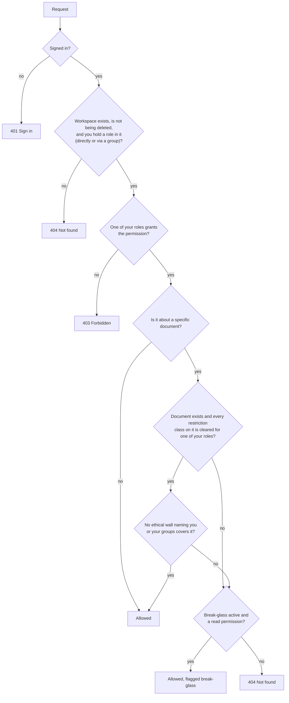

# How permissions work in opportuniTY

A plain-language guide for product owners, workspace admins and new contributors. It explains who can do what,
how the system decides, and where each check happens. The binding design is
[ADR-015](../adr/0015-security-architecture-and-trust-boundaries.md). The generated role and permission tables
are in [permission-matrix.md](permission-matrix.md). If this guide and those documents disagree, they win.

> Status as of 2026-10-04 (end of M1). Each section says what is **built** and what is **planned**, with the ticket
> that delivers it.

---

## 1. The short version

1. **Sign-in proves who you are.** opportuniTY keeps no passwords. Your organisation's identity provider (IdP:
   Entra ID, Okta, ADFS or Keycloak) signs you in and tells opportuniTY which **groups** you belong to.
2. **Roles in a workspace decide what you can do there.** A workspace admin gives a **role** (for example
   Reviewer) to a **user** or to an **IdP group**. Each role is a fixed bundle of **permissions** (for example
   `Coding.Write`). Your permissions in a workspace are the union of every role you hold there, directly or
   through any of your groups.
3. **Document security decides which documents you can see.** Even with a role, a document can be hidden from you
   by a **restriction class** (Privileged, Confidential, Attorneys' Eyes Only) your role is not cleared for, or by an
   **ethical wall** that names you or one of your groups. Hidden documents behave as if they do not exist.
4. **Every request is checked on the server, every time**, against the current database state. The screen hides
   buttons you cannot use, but that is only a convenience. The server is the authority.
5. **Default deny.** Anything not explicitly granted is refused. A wall beats every grant, including Workspace
   Admin.

---

## 2. The building blocks

### 2.1 Identity: users and groups

| Concept | What it is | Where it comes from |
|---|---|---|
| **User** | A person, identified by the IdP's issuer and subject (`iss` + `sub`). The email address and name are only for display; the system never matches on them. | Created automatically at first sign-in, **with no access to any workspace**. |
| **Group** | An IdP group (for example `reviewers`, `wall-project-falcon`). | Sent by the IdP in the `groups` claim at sign-in and re-read at least every 15 minutes (configurable 5–60) while the session lasts. |
| **Session** | Your signed-in browser session. The browser holds only an opaque cookie; tokens stay on the server. | Idle timeout 30 min, absolute 12 h. |

Why groups matter: most firms manage access in their directory (AD/Entra). Giving a role to a group means that
adding someone to `reviewers` in the directory gives them Reviewer access in opportuniTY at their next sign-in or
within the 15-minute refresh, with no change in opportuniTY.

**Built:** sign-in, sessions, group snapshot and refresh (#46, #47).

### 2.2 Two levels: installation and workspace

| Level | Role | What it allows | How it is assigned today |
|---|---|---|---|
| Installation | **Installation Admin** | Create workspaces (`Installation.ManageWorkspaces`) and assign the Break-glass workspace role (`Installation.AssignBreakGlass`, together with `Workspace.ManageUsers`). Later: manage identity settings, approve deletion, legal holds. **Grants no document access by itself.** | Members of the IdP groups listed in the setting `Authorization:InstallationAdminGroups`. Empty means nobody (default deny). A screen to manage installation roles is still to come. |
| Workspace | One of the seven built-in roles (§2.3) | Everything inside one workspace | Role assignments per workspace, to users or groups |

An Installation Admin who needs to read documents must also hold a workspace role, and is then subject to walls
like everyone else. The workspace creator automatically becomes its Workspace Admin (audited).

### 2.3 Workspace roles

Roles are **built in and fixed in code** for the MVP. Custom roles come after the MVP. Each role is a fixed list
of permissions.

| Role | Intended for | In short |
|---|---|---|
| **Workspace Admin** | Case lead, lit-support admin | Everything in the workspace |
| **Reviewer** | First-level reviewers | View, search, code (non-privilege fields), redact |
| **QC Reviewer** | Second-level / QC | Reviewer + share saved searches, bulk coding, remove redactions |
| **Privilege Reviewer** | Privilege team | QC Reviewer + privilege fields + privilege logs |
| **Production Manager** | Production / lit support | View, download natives, print, bulk coding, exports, productions, privilege logs, see all jobs |
| **Auditor (read-only)** | Compliance, internal audit | View, search, see all jobs, read the audit trail (including search text) |
| **Break-glass** | Emergency access (§4.3) | Nothing at all until an activation is running; then read-only access past restrictions and walls |

### 2.4 Permissions

There are 26 workspace permissions. The list is **closed**: it is a C# enum, and adding one is a reviewed change.
The full table is in [permission-matrix.md](permission-matrix.md#roles--permissions). Grouped by area:

| Area | Permissions |
|---|---|
| Documents | `Document.View`, `Document.DownloadNative`, `Document.Print`, `Document.ViewQuarantined` |
| Search | `Search.Execute`, `SavedSearch.Share` |
| Coding and redaction | `Coding.Write`, `Coding.WritePrivilege`, `Coding.Bulk`, `Redaction.Apply`, `Redaction.Remove` |
| Data in and out | `Import.Run`, `Import.Overlay`, `Export.Create`, `Export.Download`, `Production.Create`, `Production.Finalize`, `PrivilegeLog.Generate` |
| Jobs | `Job.ViewAll`, `Job.Manage` (users always see their own jobs) |
| Audit | `Audit.Read`, `Audit.ReadSearchText` |
| Administration | `Workspace.ManageUsers`, `Workspace.ManageSecurity`, `Workspace.ManageFields`, `Workspace.RequestDeletion`, `Workspace.ManageHolds` |

A worked example: Pat is in the IdP groups `reviewers` and `privilege-reviewers`. In workspace *ACME v. Widget*, the
group `reviewers` has the Reviewer role and `privilege-reviewers` has Privilege Reviewer. Pat's permissions there
are the union of both roles. In another workspace where neither group has a role, Pat is not a member: that
workspace does not appear in Pat's list, and its URL answers "not found".

**Built:** catalogue, roles, assignments to users and groups, effective permissions (#47); Admin › Users & Groups
and Admin › Roles & Security with their API (#53, see §2.5).

### 2.5 Managing roles (Admin › Users & Groups, Admin › Roles & Security)

- **Users & Groups** lists every user and IdP group with a role, one column per role. Ticking a box assigns the role
  and saves at once (`PUT …/role-assignments/users/{userId}` or `…/groups?name=`, needs `Workspace.ManageUsers`). Users
  can be added after their first sign-in; a group can be added by its exact IdP name before anyone from it signed in.
- **Roles & Security** shows what each built-in role allows (read-only) and which roles may see documents of each
  restriction class (a tickable matrix over the restriction-class API of #51, needs `Workspace.ManageSecurity`).
- Changes apply to the **very next request** (the decision point reads PostgreSQL every time). Search result lists
  already on screen may lag briefly; the screens say so.
- All role assignments of a workspace share **one version** (the ETag): every change sends it as `If-Match`, so two
  administrators never overwrite each other unseen. Each assigned or removed role is an audit event
  (`Security.RoleAssigned` / `Security.RoleRevoked`) written in the same transaction.
- Rules: nobody **adds** a role to themselves, directly or through a group they belong to (403 `self-protection`);
  **giving up** one of your own roles needs an explicit confirmation (409 `confirmation-required` without it) and the
  screen warns when it ends your own administration; the **last Workspace Admin** assignment can never be removed
  (409 `last-administrator`), checked under a lock so two admins cannot remove each other at the same moment;
  **Break-glass** is assigned only to individual users and only by an Installation Admin, and removing it ends the
  holder's live activation at once.

---

## 3. How a decision is made

There is **one** decision maker, the *policy decision point* (PDP, `IAuthorizationService`). Nothing else may
contain permission logic. It reads the current security state from PostgreSQL **on every request**, in one
batched query, with no cross-request cache. So a change you make (removing a role, adding a wall) applies to the
very next request.

The PDP takes the steps in order. **The first failing step decides**:

### 3.1 Why "not found" and not "forbidden"?

- If you are **not a member** of a workspace, or a document is **hidden** from you (restriction class or wall), the
  answer is **404 Not found**, identical to a workspace or document that truly does not exist. Nobody can probe
  which matters or documents exist. A malformed ID gives the same 404.
- If you **can see** the thing but your role does not allow the action (for example a Reviewer trying to export),
  the answer is **403 Forbidden**.
- The real reason (not a member, wall, class, missing permission) is never shown to the user. It is written to the
  **audit trail** (`AuthZ.Denied`) with a reason code, so admins and auditors can investigate.

### 3.2 Deny always wins

There are no "negative permissions" apart from walls. Roles only add. A wall only takes away, and it takes away
even from a Workspace Admin. The only thing that lifts a wall or a restriction class is an active break-glass
activation, and only for reading (§4.3).

---

## 4. Document-level security

### 4.1 Restriction classes

A **restriction class** is a label on a document that limits who can see it. Built in:

| Class | Set by | Visible by default to |
|---|---|---|
| `Privileged` | the privilege status field | all roles |
| `Confidential` | the confidentiality designation field | all roles |
| `AttorneysEyesOnly` | the confidentiality designation field | Workspace Admin, Privilege Reviewer, Production Manager |

- Workspace admins can **tighten** these per workspace (for example hide `Privileged` from Reviewers) and add their
  own classes bound to a field marked *security-affecting*.
- A document carrying **several** classes is visible only if **every one** of them is cleared for one of your
  roles.
- A class with no grants is visible to nobody (default deny).
- The class set of a document changes in the **same database transaction** as the coding that drives it. Coding a
  document as Privileged hides it at once; there is no window where it is still visible.

### 4.2 Ethical walls

A **wall** says "these people must not see these documents". Typical use: a lawyer who moved from the other side,
or a conflict on one custodian.

- **Members:** users and/or IdP groups.
- **Scope:** custodian values, a tagged or frozen document set, or an explicit list. Coverage is kept up to date
  automatically, including when an import adds documents for a walled custodian.
- **Effect:** covered documents disappear for members **everywhere**: document list, search hits, counts, facets,
  reports, exports, productions, bulk actions, viewer, and document details in the audit viewer.
- A wall applies to **Workspace Admins too**. A walled user still sees the workspace itself; only the covered
  documents are hidden.
- **Families are not inherited automatically** (Q-14). Extending a wall or class to a whole family is an explicit,
  previewed action. A hidden family member is simply left out, with no "restricted item" placeholder (Q-52).
- **Self-protection:** nobody can change a class grant or wall that applies to themselves, remove a wall covering
  themselves, or add a role to themselves. Another admin must do it. Giving up one of your own roles is allowed after
  an explicit confirmation, but never the workspace's last Workspace Admin assignment (§2.5).

### 4.3 Break-glass (emergency access)

For the rare case where someone must see walled or restricted material (for example a court order):

- Only an **Installation Admin** can give someone the Break-glass role, and never to themselves.
- Holding the role does **nothing**. The holder must **activate** it with an MFA re-check and a written reason, for
  **60 minutes** by default and **4 hours** at most.
- While active, it lifts restriction classes and walls for **view, search and audit read only**. No download,
  print, coding, export or production.
- Every activation and every action during it is audited separately (access path `BreakGlass`), the workspace's
  admins and auditors are notified, and it appears in a break-glass report.

**Built:** the database tables, the evaluation rules (classes, walls, break-glass) and the search filter (#47, #64);
the APIs for classes, walls, field-level restrictions and break-glass activation (#51); the class-grant matrix in
Admin › Roles & Security and Break-glass assignment in Admin › Users & Groups (#53). **Planned:** screens for ethical
walls, field-level restrictions and break-glass activation, and the notification (E14).

### 4.4 Field-level security (planned, #51)

Some fields (for example privilege notes) can be restricted per role, so they are absent from the coding panel,
the grid, search and exports for roles without access. The search field catalogue already filters through a hook
that will apply these restrictions; today it restricts nothing.

---

## 5. Where the checks happen ("enforcement points")

The PDP **decides**. Several *policy enforcement points* (PEPs) make sure it is **asked**, at every door. Each one
calls the PDP; none has its own rules.

| # | Door | What it checks | Status |
|---|---|---|---|
| PEP-1 | **Every API endpoint** under `/workspaces/{id}` | Membership and the endpoint's declared permission, before the endpoint's code runs | Built (#47) |
| PEP-2 | **Use cases on sets of documents** (bulk coding, imports, jobs) | Per-document classes and walls for the whole set, in one batched call | Built for the paths that exist (#47); grows with each feature |
| PEP-3 | **Protected-content gateway**: natives, images, text, renditions | Every byte, every download link, prefetch included; audited before the first byte | Built (#49) |
| PEP-4 | **Search** | Hidden classes and walls are filtered inside OpenSearch, **and** every page of hits is re-checked against PostgreSQL before it is returned (stale hits show nothing, Q-12) | Built (#64, #67) |
| PEP-5 | **Background workers** | A job runs as the person who started it, and their access is re-checked **for every chunk**: if they lose the job's permission the rest is cancelled; documents they can no longer see are left out of an export (and bulk coding) or fail a production run, and the difference is audited (Q-15). A worker also refuses any message whose workspace does not match the work it names, or (with signing on) whose signature is missing or wrong | Built (#100, #92, #104, #52; [runbook](../operations/message-trust.md)) |
| PEP-6 | **PostgreSQL row-level security** | Workspace isolation only: a query can never read or write another workspace's rows, even if code has a bug | Built (#48) |
| PEP-7 | **Audit viewer** | `Audit.Read`, `Audit.ReadSearchText`, walls on document details | Planned (#118) |

### 5.1 "Every endpoint declares a permission" is enforced automatically

- Each workspace endpoint must call `.RequirePermission(Permission.X)` or `.RequireWorkspaceMember()`. The second
  is for endpoints that then check a resource themselves (for example "your own job, or `Job.ViewAll`").
- An endpoint that declares neither is **refused at runtime** (fail closed) and logged as an error.
- An **architecture test** fails the build if any endpoint ships without a declaration, so this cannot slip through
  review.
- Endpoints outside a workspace use explicit policies too: `RequireInstallationPermission(...)` (installation
  admin, plus MFA where required), `RequireOwnProfile()` (your own preferences, always addressed by your session's
  user ID, never by an ID in the URL), or plain sign-in (the workspace list, which shows only workspaces you belong
  to).

### 5.2 Row-level security, the safety net

- Every table that belongs to a workspace has PostgreSQL row-level security switched on and **forced** (it binds
  even the table owner). It allows only rows of the workspace set for the current transaction.
- Only the data layer sets that workspace, and only **after** the membership check. Without it set, a query sees
  zero rows and cannot write.
- The application's database accounts cannot bypass it (no superuser, no `BYPASSRLS`).
- A migration check rejects any new workspace table without it.
- RLS handles **isolation between workspaces only**. Classes and walls are the PDP's job (§3), because they depend
  on the person, not just the workspace.

### 5.3 The screen is a convenience, not a control

The web app receives your **effective permissions** for the workspace (`GET /api/v1/workspaces/{id}` returns the
list) and uses it to:

- show only the sidebar sections you can use. For example, **Searches** needs `Search.Execute`, **Imports** needs
  `Import.Run`, and **Admin** appears if you have any of `Workspace.ManageFields`, `Workspace.ManageUsers`,
  `Workspace.ManageSecurity` or `Audit.Read`;
- block routes you could not use anyway (route guards);
- hide or disable buttons.

Typing a URL or calling the API directly gets the same server-side answer as clicking. The navigation is
deliberately built **from** the permissions, so the two cannot drift apart.

---

## 6. Special cases worth knowing

| Topic | Rule |
|---|---|
| **Saved searches, snapshots, batches, reports** | They are *candidate sets, never grants*. Running a saved search that a colleague shared with you shows only what **you** may see. Sharing needs `SavedSearch.Share` (Q-65, #71). |
| **Search counts and facets** | Computed only over documents you may see, so a count never reveals that hidden documents exist. |
| **Families** | Hidden members are omitted silently; production QC flags inconsistent families for people allowed to see them (Q-52). |
| **Jobs** | You always see your own jobs. `Job.ViewAll` shows everyone's; `Job.Manage` allows cancel and replay. |
| **Quarantined natives** (malware scan) | Never rendered for anyone. `Document.ViewQuarantined` only shows that a native is quarantined and why. |
| **Imports that create fields** | Creating new fields during an import also needs `Workspace.ManageFields`. That decision is taken when the import starts and recorded with it, so the import cannot do more than its starter was allowed to. |
| **Workspace settings and members** | Changing settings needs `Workspace.ManageSecurity`; listing members and roles needs `Workspace.ManageUsers`. |
| **Legal holds** | `Workspace.ManageHolds` places a preservation lock (with a reason) and releases it; by default a release is a request that a *different* hold manager approves. While any lock is active the database refuses every delete or purge of the workspace's documents, artifacts, history, snapshots, productions, exports, reports and audit, and the API answers `423 preservation-locked` with an audit event. Review, coding and imports continue. |
| **Workspace deletion** | A Workspace Admin *requests* it (`Workspace.RequestDeletion`); an Installation Admin *approves* it. A workspace being deleted answers 404 for everyone. |
| **MFA** | Delegated to the IdP. Always required for installation administration and break-glass activation; a workspace may require it for everything. |
| **Changes in the IdP** | Group changes reach opportuniTY at the next sign-in or the 15-minute refresh. Disabling a user in the IdP ends their sessions at the next refresh, or at once with back-channel logout. Changes made **inside** opportuniTY apply to the very next request. |

---

## 7. Audit: every "no" is recorded

- Every denial (403 **and** 404) writes an `AuthZ.Denied` audit event with who, what, when, from where, the
  permission asked for and the **real** reason code (not a member, missing permission, restriction class, wall). Bulk
  checks write one summary event with counts per reason instead of thousands of rows.
- Allowed actions are audited by the feature itself (for example `Search.Executed`, document views, downloads,
  coding changes), marked with access path `BreakGlass` when an activation made them possible.
- Changes to roles, class grants and walls emit `Role.Changed`, `Permission.Changed` and `EthicalWall.Changed`.
- The audit store is append-only with a hash chain, so tampering is detectable.

---

## 8. Try it locally

The developer stack (`deploy/docker-compose/opportunity.sh up`, then http://localhost:8080) has demo users with
password `opportunity`, mapped through IdP groups to roles in the demo workspace:

| User | IdP groups | Role in the demo workspace | What to notice |
|---|---|---|---|
| `admin.dev` | `workspace-admins` | Workspace Admin | Every section, including Admin |
| `reviewer.dev` | `reviewers` | Reviewer | No Productions, Imports, Exports or Admin |
| `privilege.dev` | `reviewers`, `privilege-reviewers` | Reviewer + Privilege Reviewer | Union of both roles |
| `walled.dev` | `reviewers`, `wall-project-falcon` | Reviewer, walled from "Project Falcon" once walls exist (#51) | Covered documents will vanish everywhere |
| `auditor.dev` | `auditors` | Auditor (read-only) | Read-only plus the audit trail |

Then try a forbidden URL directly (for example `/w/<id>/imports` as `reviewer.dev`): the page says it is not
available, and the API answers 403 or 404 exactly as described above.

---

## 9. Where to look in the code

| What | Where |
|---|---|
| Permission list | `src/Opportunity.Core/Security/Permission.cs` |
| Roles and their grants | `src/Opportunity.Core/Security/WorkspaceRole.cs` |
| The decision rules (pure function) | `src/Opportunity.Security/Authorization/PolicyEvaluator.cs` |
| The PDP (reads state, audits denials) | `src/Opportunity.Security/Authorization/AuthorizationService.cs` |
| Endpoint declarations and PEP-1 middleware | `src/Opportunity.Security/Authorization/WorkspaceAuthorization.cs` |
| Installation admin and own-profile policies | `InstallationAuthorization.cs`, `OwnProfileAuthorization.cs` (same folder) |
| Security state read from PostgreSQL | `src/Opportunity.Data/Security/PostgresSecurityStateReader.cs` |
| Row-level security | `src/Opportunity.Data/Migrations/Scripts/V0005__row_level_security.sql`, `src/Opportunity.Data/WorkspaceTransaction.cs` |
| Search visibility filter | `src/Opportunity.Search/Querying/SearchDsl.cs` (`Query`), `SearchService.cs` |
| Navigation built from permissions | `src/Opportunity.Web/src/app/core/workspace/sections.ts` |
| Generated matrix | [permission-matrix.md](permission-matrix.md) (regenerated by the unit tests; do not edit by hand) |
| Design and threat analysis | [ADR-015](../adr/0015-security-architecture-and-trust-boundaries.md), [threat-model.md](threat-model.md) |
