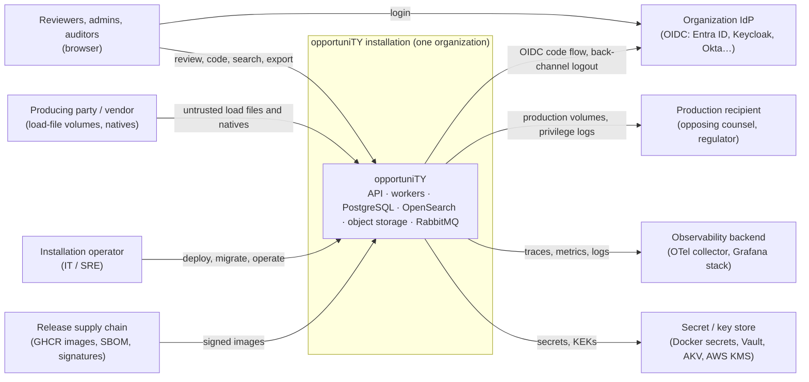
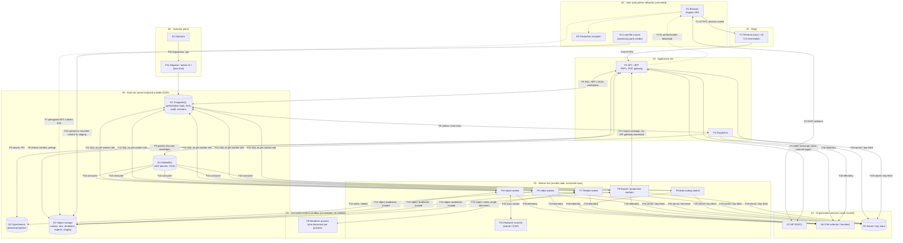

# opportuniTY Threat Model (STRIDE)

| Field | Value |
|---|---|
| **Status** | Draft for review with [ADR-015](../adr/0015-security-architecture-and-trust-boundaries.md) (Proposed) |
| **Date** | 2026-10-02 |
| **Owner (role)** | Security & Compliance |
| **Tracking issue** | #34 (`E02-T08`) |
| **Scope** | Architecture baseline §3 components, Lite and Full profiles (§16), MVP feature set (§1, §32) |
| **Method** | Data-flow diagram → trust boundaries → STRIDE per element → per-boundary threat tables → ranked register |

ADR-015 holds the binding security decisions. This document records the analysis behind them and is the register
that tickets and PR reviews check against. Product-owner decisions in [decisions.md](../plan/decisions.md) take
precedence over anything here.

## 1. System scope and assumptions

### 1.1 Deployment model (Q-01)

- opportuniTY is **self-hosted**. One installation serves one organization (law firm, corporate legal department,
  agency, service provider) with many workspaces (matters). The project runs no hosted service, so there is no
  cross-organization multi-tenancy. **Workspace isolation is still mandatory:** matters in one installation belong to
  different clients and are often subject to different protective orders and ethical walls.
- **Lite** is for evaluation and development only and must not hold real client data. **Full** is the only
  supported production profile: TLS between all components, PostgreSQL RLS, OpenSearch security plugin, sandboxed
  render workers and malware scanning, all on by default.
- The installation operator (the organization's IT team) controls the hosts, container runtime, databases, object
  store, key store and IdP. The platform cannot defend against an operator with infrastructure root. It can make
  that operator's tampering **detectable**. See AR-02.

### 1.2 Assets (what an attacker wants)

| ID | Asset | Why it matters |
|---|---|---|
| A1 | Document content: natives, extracted text, page images, renditions | Client confidential and privileged material. Disclosure can waive privilege (FRE 502) or breach a protective order |
| A2 | Protected metadata: control numbers, file names, custodians, snippets/highlights, counts and facets of restricted documents | Q-12 and Q-13 treat these as protected content. Their existence alone can disclose strategy |
| A3 | Coding and privilege state, redactions | Integrity is critical: a flipped privilege flag produces a privileged document |
| A4 | Productions and exports (volumes, load files, privilege logs) | Legally binding output. Leaks and alterations are both catastrophic |
| A5 | Audit trail, including executed search text (Q-16) | Defensibility evidence (FRCP 26(g)/37(e)). Also sensitive in its own right |
| A6 | Security state: roles, restriction-class grants, ethical walls, break-glass | Changing it controls who sees A1–A5 |
| A7 | Credentials and keys: DB/broker/storage/OpenSearch credentials, OIDC client secret, data-protection keys, KEKs, audit signing key | Each one unlocks a store wholesale |
| A8 | Availability of review and production deadlines | Court deadlines. A DoS during production can cause sanctions |

### 1.3 Adversaries

| ID | Adversary | Capability assumed |
|---|---|---|
| X1 | External network attacker | Reaches the edge (reverse proxy / load balancer) and nothing else. No credentials |
| X2 | Authenticated user acting outside their authority | Valid session in one workspace. Curious or malicious reviewer, contract attorney, or a **walled** user (Q-13). Can craft any HTTP request |
| X3 | Workspace administrator acting outside their authority | Manages users, roles and walls in a workspace. May be walled (Q-13) |
| X4 | Producing party / hostile content author | Controls every byte of imported DAT/OPT/TXT and natives, including deliberately weaponized files |
| X5 | Compromised component | Code execution in one worker container (most likely the renderer, through X4) or one leaked service credential |
| X6 | Supply-chain attacker | Malicious dependency, base image or release artifact |
| X7 | Infrastructure operator (trusted, out of scope for prevention) | Root on hosts and stores. In scope only for **detection** (AR-02) |

### 1.4 Out of scope

Endpoint security of reviewer workstations (beyond not delivering malware to them), IdP internals, physical
security, operator backup handling beyond what §16/ADR-016 ships, and the recipient's handling of a production once
delivered.

## 2. System context



## 3. Data-flow diagram (level 1) and trust boundaries

Element IDs (E = external entity, P = process, D = data store, F = data flow) are used in every table below.
Dashed borders are trust zones. A trust boundary (TB) is any flow that crosses a zone border.



In **Lite** all Z3 processes run as one combined worker process (ADR-019 R5). Z5 stores run as single containers on
one host without inter-component TLS, and P8 runs with the same flags where Docker supports them. These are the
reduced guarantees of AR-04.

### 3.1 Trust boundaries

| TB | Boundary | Flows | Why it is a boundary |
|---|---|---|---|
| TB1 | Browser ↔ edge/API | F1, F1b | Untrusted client and network. Every request is attacker-controlled (X1, X2) |
| TB2 | Browser/API ↔ IdP | F2, F3 | Identity is asserted by an external system. Claims, including groups used by walls, are only as fresh as the last refresh |
| TB3 | API ↔ PostgreSQL | F4 | Authoritative store shared by every workspace. A query bug crosses a matter boundary |
| TB4 | API ↔ OpenSearch | F5 | Derived, possibly stale projection that holds every workspace's text in shared indexes |
| TB5 | API/browser ↔ object storage | F6, F7 | Bulk content store. Presigned URLs are bearer tokens outside the API's control |
| TB6 | Dispatcher ↔ RabbitMQ ↔ workers | F8, F9, F10 | Messages cross processes and could be injected or replayed. Envelopes carry a `WorkspaceId` that must not be trusted |
| TB7 | Workers ↔ data stores | F11, F12, F13 | Workers act without a user present. Credential scope decides the blast radius of X5 |
| TB8 | Render broker ↔ renderer (untrusted content) | F14 | Complex parsers run on hostile input (X4). Highest RCE exposure |
| TB9 | Load-file source ↔ import | F15, F16 | Producing-party data is hostile by assumption (X4) |
| TB10 | Export/production ↔ recipient | F17, F17b | Output leaves the installation for good. Mistakes cannot be recalled (clawback is a legal process, not a control) |
| TB11 | Operator ↔ admin tooling and in-app administration | F20 + admin API surface | High privilege. Insider abuse and mistakes (X3, X7) |
| TB12 | Supply chain ↔ installation | image pull, dependencies | Code the organization runs but did not write (X6) |
| TB13 | Services ↔ telemetry and secret stores | F18, F19 | Telemetry can carry protected content out of the platform. Secret stores hold A7 |

## 4. STRIDE per element

The cells hold threat IDs from §5. Following the STRIDE-per-element convention, external entities are assessed for
S and R, data stores for T, I and D (plus R for the audit store), data flows for T, I and D, and processes for all
six. "—" means no credible threat beyond the ones listed elsewhere for that element.

| Element | S | T | R | I | D | E |
|---|---|---|---|---|---|---|
| E1 Browser / user | T-01, T-13, T-14 | | T-09 | | | |
| E2 IdP | T-11, T-12 | | | | | |
| E3 Operator | T-51 | | T-51 | | | |
| E4 Load-file source | T-46 | | T-46 | | | |
| E5 Recipient | | | T-50 | | | |
| P1 Edge | T-01 | — | — | T-06 | T-08 | — |
| P2 API + BFF | T-01, T-02 | T-03, T-17 | T-09 | T-04, T-05, T-07, T-10, T-21, T-22, T-23, T-27, T-30, T-64 | T-08, T-26 | T-04, T-05, T-52 |
| P3 Dispatcher | T-31 | T-31 | — | — | T-34 | T-37 |
| P4 Import worker | T-31 | T-43, T-44 | T-46 | T-43 | T-44 | T-37, T-43 |
| P5 Index worker | T-31 | T-25 | — | T-25 | T-34 | T-37 |
| P6 Bulk-coding worker | T-31 | T-35 | T-09 | T-35, T-38 | T-34 | T-35, T-37 |
| P7 Render broker | T-31 | T-42 | — | — | T-41 | T-37 |
| P8 Renderer (sandbox) | — | T-39 | — | T-40 | T-41 | T-39 |
| P9 Export / production | T-31 | T-47, T-48 | T-50 | T-35, T-38, T-47 | T-34 | T-35, T-37 |
| P10 Malware scanner | — | T-45 | — | — | T-44 | — |
| P11 Migrator / admin CLI | — | T-53 | — | — | — | T-53 |
| D1 PostgreSQL (incl. audit, sessions) | | T-15, T-16, T-18, T-19 | T-19 | T-15, T-16, T-20, T-56, T-63 | T-34 | |
| D2 OpenSearch | | T-24, T-25 | | T-21, T-22, T-24 | T-26 | |
| D3 Object storage | | T-29 | | T-27, T-28, T-56, T-63 | — | |
| D4 RabbitMQ (queues, DLQ) | | T-31 | | T-33 | T-34 | |
| D5 Secret / key store | | — | | T-20, T-59, T-61 | — | |
| D6 Telemetry (E6) | | — | | T-60 | — | |
| F1 / F1b HTTPS | | T-62 | | T-62 | T-08 | |
| F4, F5, F11, F12, F13 internal links | | T-62 | | T-62 | — | |
| F9 / F10 AMQP | | T-31 | | T-36 | T-34 | |
| F7 presigned GET | | — | | T-27 | — | |
| F14 broker ↔ renderer | | T-42 | | T-40 | T-41 | |
| F16 ingest | | T-43, T-44 | | — | T-44 | |
| F17 export download | | — | | T-49 | — | |
| Supply chain (TB12) | T-58 | T-57, T-58 | | T-59 | | T-57 |
| In-app admin (TB11) | | T-55 | T-52 | | | T-52, T-54 |

## 5. Threats and mitigations per trust boundary

**Rating:** inherent risk *before* the listed mitigations = Likelihood (1 low · 2 plausible · 3 expected) × Impact
(1 nuisance · 2 one workspace degraded or limited disclosure · 3 privileged or cross-workspace disclosure, integrity
loss of A3/A4/A5, or RCE). **High ≥ 6, Medium 3–4, Low ≤ 2.** Ticket keys link to issues through
[issue-map.md](../plan/issue-map.md). The ADR-015 column points to the rule in the ADR that binds the mitigation.

### TB1 — Browser ↔ edge/API

| ID | STRIDE | Threat | Mitigation | ADR-015 | Owning ticket(s) | Rating |
|---|---|---|---|---|---|---|
| T-01 | S, I | Session theft, fixation or token exposure in the SPA (XSS reads tokens, tokens in URL/storage) | BFF: Angular never holds access or refresh tokens. `__Host-` session cookie, `HttpOnly`, `Secure`, `SameSite=Lax`. Session ID rotated at login and at privilege change (break-glass). Server-side session store in PG. Idle 30 min / absolute 12 h | D4 | `E05-T01` #46, `E15-T02` #123 | 2×3 = **6 High** |
| T-02 | T, E | CSRF triggers state changes (bulk privilege coding, wall edits, export) | `SameSite=Lax` plus a synchronizer anti-CSRF token in a request header on every unsafe method. `Origin`/`Sec-Fetch-Site` check. No state change on GET | D4 | `E05-T01` #46 | 2×3 = **6 High** |
| T-03 | T, I, E | Stored XSS from document-derived strings (file names, metadata, extracted text, highlight fragments, DAT values) | Angular template escaping only. `bypassSecurityTrust*` banned by lint. Highlights use server-chosen sentinel markers, are HTML-encoded by the API and converted to elements client-side (raw OpenSearch HTML never reaches the DOM). CSP without inline script (D4.6) | D4, D12 | `E05-T01` #46, `E11-T01` #95, `E16-T04` #130, `E16-T12` #138 | 2×3 = **6 High** |
| T-04 | I, E | IDOR / cross-workspace access by ID substitution or a client-supplied workspace header | Workspace taken only from the route `/api/v1/workspaces/{id}`. Membership checked on every request (non-member → 404). Resource-level PDP check. RLS as backstop. L7 attack suite substitutes foreign IDs on every route | D5, D7 | `E05-T02` #47, `E05-T03` #48, `E05-T05` #50 | 3×3 = **9 High** |
| T-05 | I, E | Authorization gap: an endpoint without a policy, ad-hoc checks, or one surface (grid, export, saved search, report, prefetch) that forgets restriction classes or walls | Single default-deny PDP and closed permission enum. Architecture test: every endpoint has a policy or is on the `AllowAnonymous` allow-list. Per-surface walled-user tests. Permission matrix generated from code | D5 | `E05-T02` #47, `E05-T06` #51, `E05-T05` #50 | 3×3 = **9 High** |
| T-06 | T, I | Clickjacking, MIME sniffing, referrer leakage of IDs and URLs | `frame-ancestors 'none'`, `X-Content-Type-Options: nosniff`, `Referrer-Policy: no-referrer`, COOP/CORP `same-origin` | D4 | `E05-T01` #46 | 1×2 = 2 Low |
| T-07 | I | Authorized insider exfiltrates at scale through view, print, native download or many small exports | Download and print are separate permissions, off for Reviewer (Q-18). Every retrieval audited (document, rendition, outcome). Per-user rate limits and volume alerts in M5. Interim: AR-03 | D5, D11 | `E05-T04` #49, `E14-T02` #116, `E05-T10` #55 | 2×3 = **6 High** |
| T-08 | D | Application-layer DoS: expensive queries, unbounded page sizes, export/job floods, slow-loris | Edge timeouts and body limits. Cursor-only paging with capped page size (Q-32). Query complexity limits. Concurrency caps per user for jobs. Rate limits (M5) | D11 | `E07-T07` #69, `E07-T05` #67, `E05-T10` #55, `E19-T06` #162 | 2×2 = 4 Medium |
| T-09 | R | A reviewer disputes a coding, privilege or redaction action, or a view | Audit event in the same transaction as the action, with actor, on-behalf-of, session hash, IP, user agent and correlation ID. CodingEvent provenance cross-linked | D13 | `E02-T07` #33, `E14-T01` #115, `E14-T02` #116 | 2×3 = **6 High** |
| T-10 | I | Protected content persists in browser caches on shared machines | `Cache-Control: no-store` on every protected-content and API response. No service-worker content caching. Logout clears client state | D4, D8 | `E05-T04` #49, `E15-T02` #123 | 1×2 = 2 Low |

### TB2 — Browser/API ↔ IdP

| ID | STRIDE | Threat | Mitigation | ADR-015 | Owning ticket(s) | Rating |
|---|---|---|---|---|---|---|
| T-11 | S | Token forgery or mis-validation (wrong issuer or audience, `alg` confusion, missing `state`/`nonce`, code interception) | Authorization Code + PKCE (S256), `state` and `nonce` required. Issuer pinned via discovery. Audience = configured client ID. Asymmetric algorithms only (no `none`/HS*). Clock skew ≤ 2 min. Confidential client with `private_key_jwt` preferred over a client secret | D3 | `E05-T01` #46 | 1×3 = 3 Medium |
| T-12 | S, I, E | Stale identity: a deactivated user, or a user newly added to a walled IdP group, keeps access until the session ends | Principal refresh at most every 15 min (re-query userinfo/refresh token and group claims; failure ends the session). Back-channel logout. Individual-user walls take effect immediately. Wall-group membership changes have a bounded window: AR-01 | D3, D6 | `E05-T01` #46, `E05-T06` #51 | 2×3 = **6 High** (residual → AR-01) |
| T-13 | S | Account takeover by identity collision (matching on email or username, or a second issuer asserting the same email) | Users keyed on (`iss`, `sub`). Email is display-only. One configured issuer per installation in MVP. Just-in-time provisioning grants no workspace access | D3 | `E05-T01` #46 | 1×3 = 3 Medium |
| T-14 | S | Weak authentication for high-impact roles (admin, privilege reviewer, break-glass) | MFA delegated to the IdP and enforced via `acr`/`amr`: configurable per workspace and always required for break-glass activation. Step-up re-authentication or 403 | D3, D6 | `E05-T01` #46, `E05-T06` #51 | 2×3 = **6 High** |

### TB3 — API ↔ PostgreSQL

| ID | STRIDE | Threat | Mitigation | ADR-015 | Owning ticket(s) | Rating |
|---|---|---|---|---|---|---|
| T-15 | I, T | Missing tenant predicate in EF Core, Dapper, raw SQL or `COPY` leaks or writes across workspaces | `ENABLE` + `FORCE ROW LEVEL SECURITY` on every workspace-owned table, keyed on `current_setting('app.workspace_id')`. App roles are non-owner and `NOBYPASSRLS`. Unset context → zero rows. EF global filters only as an extra layer | D7 | `E05-T03` #48 | 3×3 = **9 High** |
| T-16 | E, I | RLS bypass: session-level `SET` leaking through the pool, direct partition access, `SECURITY DEFINER` functions, views without `security_invoker`, a BYPASSRLS role used at runtime, or RLS disabled to make `COPY FROM` work | `SET LOCAL` inside a transaction only, through the single `Opportunity.Data` connection factory. Grants on partitioned parents only. Views `security_invoker = true`. `SECURITY DEFINER` banned without security review. Bulk `COPY` goes to a session-temp staging table, then `INSERT … SELECT` under RLS. Schema tests enforce all of this | D7 | `E05-T03` #48, `E04-T01` #39 | 2×3 = **6 High** |
| T-17 | T, I, E | SQL injection through query-language field names, sort keys, dynamic field (custom field) identifiers or filters | Parameters only. Identifiers resolved from the field-definition catalog to known column/JSON paths and never interpolated from input. CodeQL | D5, D15 | `E07-T07` #69, `E04-T03` #41, `E01-T04` #24 | 2×3 = **6 High** |
| T-18 | T | Cross-workspace references (a snapshot, job or coding row in WS-A pointing at a WS-B document) | Composite keys and FKs `(WorkspaceId, Id)` everywhere. RLS `WITH CHECK` on writes | D7 | `E05-T03` #48, `E04-T02` #40 | 1×3 = 3 Medium |
| T-19 | T, R | Audit rows altered or deleted through the application role | App and worker roles have `INSERT`/`SELECT` only on audit. Partition drop only by the retention role. Per-workspace hash chain and signed checkpoints (M3). WORM archive (M5) | D13 | `E14-T01` #115, `E14-T03` #117, `E14-T07` #121 | 2×3 = **6 High** |
| T-20 | I, E | Database credentials stolen from config, environment or images | Credentials only through `ISecretProvider` (`*_FILE`/Docker secrets, Vault/AKV/AWS SM). One role per component (D9). No credentials in images or committed Compose. First-run generation in Lite | D9, D10 | `E05-T09` #54, `E19-T06` #162 | 2×3 = **6 High** |

### TB4 — API ↔ OpenSearch

| ID | STRIDE | Threat | Mitigation | ADR-015 | Owning ticket(s) | Rating |
|---|---|---|---|---|---|---|
| T-21 | I | Workspace filter removed or omitted (AST `OR`/`NOT` injection, `workspaceId:` field injection, aggregations, highlight, PIT or `search_after` continuation without the filter) | One `ISearchService` path. Workspace term plus routing in top-level `bool.filter`, outside user-controlled clauses. Property test over 10K random ASTs. Architecture test restricting the OpenSearch client to `Opportunity.Search` (ADR-019 R6) | D8 | `E07-T05` #67, `E07-T06` #68, `E07-T07` #69 | 2×3 = **6 High** |
| T-22 | I | Stale security projection: restricted or walled hits, snippets, control numbers, counts or facets visible after a privilege, confidentiality or wall change | Principal side (walls, granted classes) computed from PG on every request. Document side kept fresh by the priority lane (SLO ≤ 5 s p95, Q-10). **Pending-set exclusion** of documents with unindexed security changes. **Per-page post-filter** against PG before any hit is returned (Q-12). Counts labelled ≈ | D8 | `E07-T05` #67, `E05-T06` #51, `E07-T08` #70, `E19-T05` #161 | 3×3 = **9 High** |
| T-23 | I | PIT IDs, `search_after` cursors or result IDs replayed by another user or in another workspace | Opaque server-side cursor handle bound to (user, session, workspace, query hash). Raw PIT IDs never leave the API. Mismatch → 404 | D8 | `E07-T05` #67 | 2×3 = **6 High** |
| T-24 | I, T, D | Direct OpenSearch access (exposed port, anonymous access, API user allowed to read system indices or delete indices) | Full: security plugin, TLS, per-service users (API read-only on product aliases, index worker write-only, admin cert operator-only), no published ports. Lite: AR-04 | D9, D14 | `E19-T06` #162, `E07-T01` #63 | 2×3 = **6 High** |
| T-25 | T, I | A delayed or retried index write overwrites newer security attributes and re-exposes a document in search | Version-safe writes and "row missing in PG = delete" (ADR-001). Shadow-ledger oracle. Content is still protected by the post-filter and the gateway | D8 | `E02-T02` #28, `E07-T03` #65, `E17-T07` #145 | 2×2 = 4 Medium |
| T-26 | D | Search DoS: leading wildcards, huge proximity spans, term expansion, deep aggregations | Query-complexity limits (max clauses, expansions, span, nesting) → 400. Search timeouts and `max_buckets`. Cursor paging | D11 | `E07-T07` #69, `E07-T06` #68 | 2×2 = 4 Medium |

### TB5 — API/browser ↔ object storage

| ID | STRIDE | Threat | Mitigation | ADR-015 | Owning ticket(s) | Rating |
|---|---|---|---|---|---|---|
| T-27 | I | Presigned URL leaked or replayed (logs, traces, referrer, browser history, forwarded link) | Issued only after the PDP check and an audit event. Single object, GET only, TTL ≤ 120 s, forced `attachment` disposition and `application/octet-stream`. Never logged (scrubbing test). `Referrer-Policy: no-referrer`. Used for natives and packages only, never for viewer renditions | D12 | `E05-T04` #49 | 2×3 = **6 High** |
| T-28 | I | Content reachable without a PDP check: guessable keys, public bucket, Lite filesystem served by a static file server | Private buckets only. Workspace-prefixed keys with random object IDs (ADR-011). Gateway is the only route that returns content or URLs (architecture test). Lite filesystem provider never mounted into a web server | D12 | `E05-T04` #49, `E02-T06` #32, `E19-T01` #157 | 2×3 = **6 High** |
| T-29 | T | Stored natives, renditions or production volumes replaced or altered | SHA-256 recorded at ingest and at production. Production manifests verified on re-run (Q-08). Write scopes per component (D9). Object lock for finalized productions where the provider supports it | D9, D12 | `E02-T06` #32, `E08-T04` #78, `E12-T07` #106 | 1×3 = 3 Medium |
| T-30 | E, I | Active content served from the app origin (HTML or SVG natives, PDF JavaScript) runs script with the user's session | Natives only as `attachment` + `application/octet-stream` + `nosniff`. The viewer shows only derived renditions (raster images, sanitized PDF, plain text). HTML natives rendered to image, never `text/html` | D12, D14 | `E11-T03` #97, `E05-T04` #49, `E16-T04` #130 | 2×3 = **6 High** |

### TB6 — Dispatcher ↔ RabbitMQ ↔ workers

| ID | STRIDE | Threat | Mitigation | ADR-015 | Owning ticket(s) | Rating |
|---|---|---|---|---|---|---|
| T-31 | S, T, E | Forged, injected or replayed message: a foreign `WorkspaceId`, a valid `JobId` paired with a wrong workspace, or a duplicate redelivery | Envelope `WorkspaceId` is a hint. The worker loads the Job/Task row under RLS with the hinted workspace and rejects if the row is invisible or differs. All scope (documents, actor, snapshot) re-derived from PG. Payloads are IDs only. Idempotent consumers. Per-type broker users (only the dispatcher publishes). Optional HMAC. Rejection → DLQ + `Integrity.MessageRejected` | D9 | `E06-T05` #60, `E05-T07` #52, `E06-T01` #56 | 2×3 = **6 High** |
| T-32 | S, E | Broker credential compromise, the `guest` default account, or an exposed management UI | No `guest`. Per-type users with vhost and exchange/queue permissions (patterns in `RabbitMqPermissions`; runtime components declare nothing, only the migrator configures). Management UI not published (Full). AMQPS | D9, D14 | `E05-T07` #52, `E19-T06` #162, `E06-T01` #56 | 2×2 = 4 Medium |
| T-33 | I | Queue or DLQ contents disclose matter data | Envelopes carry identifiers only (no text, names or metadata). DLQ readable only by the operator user | D9 | `E05-T07` #52, `E06-T06` #61 | 1×1 = 1 Low |
| T-34 | D | Poison or flood messages exhaust workers or block queues | Bounded attempts, then `Failed` in PG and a DLQ copy for diagnostics. Quorum `x-delivery-limit`; malformed envelopes dead-lettered and unknown types/majors parked without reaching handlers (`E06-T01`). Prefetch and queue-length limits. Leases. Replay is a PG state reset | D9 | `E06-T01` #56, `E06-T02` #57, `E06-T05` #60, `E06-T06` #61 | 2×2 = 4 Medium |
| T-35 | E, I | Async job acts with stale authority: the initiator lost access, was walled or lost a restriction-class grant after submission | Each export, production and bulk-coding chunk re-authorizes the initiating actor (from `Job.CreatedBy`) against current PG state. Denied documents are excluded and reported (Q-15). The delta is audited | D9 | `E05-T07` #52, `E12-T01` #100, `E12-T05` #104, `E10-T04` #92 | 3×3 = **9 High** |
| T-36 | I | AMQP traffic sniffed on the internal network | AMQPS in Full. Payload-free envelopes | D14 | `E19-T06` #162 | 1×1 = 1 Low |

### TB7 — Workers ↔ data stores

| ID | STRIDE | Threat | Mitigation | ADR-015 | Owning ticket(s) | Rating |
|---|---|---|---|---|---|---|
| T-37 | E | A shared superuser connection string turns any worker compromise into full data access | Credential matrix (D9): a distinct PG role, broker user, storage credential and OpenSearch user per worker type, each with least privilege. No shared credentials in Full Compose | D9 | `E05-T07` #52, `E19-T06` #162 | 2×3 = **6 High** |
| T-38 | I | A materialized snapshot, saved search, review batch or term report created by user A is consumed by user B, who is walled from part of it | Snapshots and saved searches are candidate sets, never grants. Every consumption (grid, export, production, bulk coding, reports) filters through the PDP for the consuming principal | D5, D6 | `E10-T02` #90, `E07-T09` #71, `E05-T06` #51 | 2×3 = **6 High** |

### TB8 — Render broker ↔ renderer (untrusted content)

| ID | STRIDE | Threat | Mitigation | ADR-015 | Owning ticket(s) | Rating |
|---|---|---|---|---|---|---|
| T-39 | E, T, I | Remote code execution in the renderer (LibreOffice, Ghostscript, ImageMagick, PDFium and similar parsers) through a malicious native | Broker/renderer split. Renderer: non-root, read-only rootfs, all capabilities dropped, `no-new-privileges`, seccomp + AppArmor/SELinux, **no network**, **no credentials**, one document per process, tmpfs workspace. Renderer chosen with CVE history as a criterion. Patch cadence | D14 | `E11-T03` #97, `E11-T05` #99, `E11-T02` #96 | 3×3 = **9 High** |
| T-40 | I | Renderer exfiltrates data or performs SSRF (external entity, remote image, UNC path, PDF/Office link fetch) | No network namespace egress. External fetch, macros, scripting and XXE disabled in renderer configuration. Malicious-corpus test observes no connections | D14 | `E11-T03` #97 | 2×3 = **6 High** |
| T-41 | D | Decompression bombs, pathological files or infinite loops exhaust render capacity | CPU, memory, pids, wall-clock and output-size limits per process. A kill fails only that document. Retry ceiling | D14 | `E11-T03` #97, `E11-T02` #96 | 3×2 = **6 High** |
| T-42 | T | A compromised renderer returns crafted output that attacks the viewer, the production pipeline or the broker | The broker validates output type, dimensions and size and re-encodes images before storing. The renderer cannot write to storage directly | D14 | `E11-T03` #97, `E11-T02` #96 | 1×2 = 2 Low |

### TB9 — Load-file source ↔ import

| ID | STRIDE | Threat | Mitigation | ADR-015 | Owning ticket(s) | Rating |
|---|---|---|---|---|---|---|
| T-43 | T, I, E | Path traversal through DAT/OPT/TXT references (`..\..\`, absolute or UNC paths, symlinks) reads or overwrites files outside the import root | All references resolved against an import-root jail. `..`, absolute, UNC and drive paths rejected. Symlinks not followed. Fuzz tests | D15 | `E08-T05` #79, `E08-T04` #78, `E08-T09` #83 | 3×3 = **9 High** |
| T-44 | D, T | Parser attacks: giant lines or fields, delimiter or encoding confusion, BOM tricks, archive and decompression bombs | Streaming parser with configurable max line, field, field-count and file size. Zip ratio and entry-count limits. Encoding detection with explicit override. Rejects go to the error file | D15 | `E08-T01` #75, `E08-T09` #83 | 3×2 = **6 High** |
| T-45 | E (client) | Malware in natives reaches reviewer workstations through download | Scan at ingest (clamd by default, ICAP pluggable). Infected or unscannable → `Quarantined` restriction class: never rendered, downloadable only with `Document.ViewQuarantined`. Download off for Reviewer (Q-18) | D16 | `E08-T09` #83 | 3×3 = **9 High** |
| T-46 | T, R | Evidence integrity disputes: native does not match the load-file hash, or custodian or metadata spoofed | MD5/SHA-1/SHA-256 verified against DAT values when present. Mismatch flagged in the import report. Import provenance (batch, source volume, operator) audited | D15 | `E08-T09` #83, `E08-T06` #80 | 2×2 = 4 Medium |

### TB10 — Export/production ↔ recipient

| ID | STRIDE | Threat | Mitigation | ADR-015 | Owning ticket(s) | Rating |
|---|---|---|---|---|---|---|
| T-47 | I | A privileged or walled document is produced, or redacted content leaks through text, metadata, annotations or PDF layers | Production QC gate (blocking checks, audited overrides). Burn-in verification (no text under redactions, re-OCR check, metadata scrub). Redacted documents always imaged (Q-22). Per-chunk re-authorization (Q-15) | D9 | `E12-T06` #105, `E12-T07` #106, `E13-T02` #110, `E12-T05` #104 | 2×3 = **6 High** |
| T-48 | T | Formula (CSV) injection in produced DAT/CSV/XLSX and privilege logs attacks the recipient's spreadsheet | Cells starting with `=`, `+`, `-`, `@`, tab or CR are neutralized in platform-produced delimited and spreadsheet files | D15 | `E08-T09` #83, `E12-T05` #104, `E13-T03` #111 | 2×2 = 4 Medium |
| T-49 | I | Export package intercepted, forwarded or downloaded by the wrong person | MVP: package downloadable only through the gateway by the requesting user, with an `Export.Download` audit event and TLS. Package encryption and expiring links in M5. Interim: AR-03 | D12 | `E12-T01` #100, `E05-T10` #55 | 2×3 = **6 High** (residual → AR-03) |
| T-50 | R | Dispute over what was produced | Frozen production specification, manifest with per-file checksums, exact reproducibility (Q-08), production audit events | D13 | `E12-T02` #101, `E12-T07` #106 | 1×3 = 3 Medium |

### TB11 — Operator ↔ admin tooling and in-app administration

| ID | STRIDE | Threat | Mitigation | ADR-015 | Owning ticket(s) | Rating |
|---|---|---|---|---|---|---|
| T-51 | I, T, R | Malicious or compromised infrastructure operator (DB superuser, storage root, host root) reads or alters data | Cannot be prevented by the platform. **Detected** by the hash chain, signed checkpoints and WORM archive. Separation of roles documented for operators. Residual: AR-02 | D13 | `E14-T03` #117, `E14-T07` #121, `E14-T06` #120 | 2×3 = **6 High** (residual → AR-02) |
| T-52 | E, R | In-app privilege escalation: an admin grants themselves roles or class visibility, removes a wall that applies to them, or abuses break-glass | A principal cannot change a wall that applies to them, or their own role or class grants. Break-glass: separate role, justification, time-boxed (60 min default), MFA, read-only, separate audit category, notification to auditors. Wall-proof and access-review reports | D6 | `E05-T06` #51, `E05-T08` #53, `E14-T06` #120 | 2×3 = **6 High** |
| T-53 | E | The migrator or maintenance role is used at runtime, or migrations run at API startup with owner rights | One-shot migrator under an advisory lock, never at API startup. Owner and retention roles never configured in API or worker hosts | D7, D9 | `E04-T01` #39 | 1×3 = 3 Medium |
| T-54 | E, T | Unauthorized DLQ replay, job cancel or job-state edits | `Job.Replay`/`Job.Manage` permissions, audited. Replay resets PG state, so no message is re-sent verbatim | D5 | `E06-T06` #61 | 1×2 = 2 Low |
| T-55 | T | Spoliation: deleting a held workspace, production, log or audit | Preservation lock blocks deletion. Two-person approval (Q-23). Destruction certificate | D13 | `E20-T01` #166, `E20-T02` #167 | 1×3 = 3 Medium |
| T-56 | I | Incomplete matter deletion leaves recoverable data in OpenSearch, storage, DLQs or backups | Fenced deletion across every store. Crypto-shred when per-workspace keys are enabled. Backup expiry documented | D10 | `E20-T02` #167, `E05-T09` #54, `E19-T07` #163 | 2×2 = 4 Medium |
| T-64 | I | The audit viewer exposes executed search text, or details of walled documents, to the wrong role | `Audit.Read` for Admin and Auditor only. Search text only with `Audit.ReadSearchText` (Admin/Auditor, Q-16). Walls apply to document details in audit results | D5, D13 | `E14-T04` #118, `E02-T07` #33 | 2×2 = 4 Medium |

### TB12 — Supply chain ↔ installation

| ID | STRIDE | Threat | Mitigation | ADR-015 | Owning ticket(s) | Rating |
|---|---|---|---|---|---|---|
| T-57 | T, E | Malicious or vulnerable dependency (NuGet, npm, base image, renderer packages) | Central package management with lock files. Dependabot, OSV-Scanner and dependency review. CodeQL. Trivy. Critical/High fail the PR unless an exception with an expiry exists. License check | D17 | `E01-T04` #24, `E01-T05` #25 | 2×3 = **6 High** |
| T-58 | T, S | Tampered image or release artifact, or a mutable tag swapped | Keyless cosign signatures, SLSA provenance, CycloneDX SBOM per image. Compose references digests. Operator `cosign verify` instructions | D17 | `E01-T05` #25, `E01-T06` #26 | 1×3 = 3 Medium |
| T-59 | I | A secret committed to the repository, an image layer or a sample config | Secret scanning with push protection plus gitleaks. No secrets in images. First-run generation | D10, D17 | `E01-T04` #24, `E05-T09` #54 | 2×3 = **6 High** |

### TB13 — Services ↔ telemetry and secret stores; internal transport

| ID | STRIDE | Threat | Mitigation | ADR-015 | Owning ticket(s) | Rating |
|---|---|---|---|---|---|---|
| T-60 | I | Protected content in logs, traces or metrics: search text, control numbers, file names, presigned URLs, tokens, connection strings | Span-attribute and log-field allow-list (IDs and counts only). Search text only in audit (Q-16). Scrubbing tests on OTel exports | D10 | `E19-T04` #160, `E05-T04` #49, `E05-T09` #54 | 3×2 = **6 High** |
| T-61 | I, E | Key or secret store compromise, or keys never rotated | `IKeyProvider`/`ISecretProvider` abstraction. KeyId recorded per object. Rotation runbook and rewrap job. Data-protection keyring encrypted with a KEK | D10 | `E05-T09` #54 | 1×3 = 3 Medium |
| T-62 | I, T | Plaintext or unauthenticated traffic between components (Full) | TLS 1.2+ (1.3 preferred) on every link. PG `sslmode=verify-full`. AMQPS. OpenSearch HTTPS. HTTPS to object storage. Internal CA from deployment tooling. Lite: AR-04 | D14 | `E19-T06` #162 | 2×3 = **6 High** |
| T-63 | I | Backups (PG dumps/WAL, OpenSearch snapshots, bucket replicas) exposed | Backups encrypted and access-controlled. Snapshot repository credentials separate. Operator guidance in the backup runbook | D10 | `E19-T07` #163, `E19-T08` #164 | 2×3 = **6 High** |

## 6. Ranked threat register

Ordered by inherent score, then by boundary. Every High maps to at least one ticket (all exist in the plan). Highs
with a residual the tickets do not close also map to an accepted-risk entry (§7).

| Rank | ID | Threat (short) | Boundary | Score | Mitigated by | Residual |
|---|---|---|---|---|---|---|
| 1 | T-04 | IDOR / cross-workspace by ID substitution | TB1 | 9 | #47, #48, #50 | — |
| 2 | T-05 | Authorization gap on an endpoint or surface | TB1 | 9 | #47, #51, #50 | — |
| 3 | T-15 | Missing tenant predicate in SQL | TB3 | 9 | #48 | — |
| 4 | T-22 | Stale security projection leaks hits, counts, facets | TB4 | 9 | #67, #51, #70, #161 | — |
| 5 | T-35 | Async job with stale authority | TB6 | 9 | #52, #100, #104, #92 | — |
| 6 | T-39 | Renderer RCE | TB8 | 9 | #97, #99, #96 | — |
| 7 | T-43 | Path traversal in load files | TB9 | 9 | #79, #78, #83 | — |
| 8 | T-45 | Malware delivered to reviewers | TB9 | 9 | #83 | — |
| 9 | T-01 | Session theft / token exposure | TB1 | 6 | #46, #123 | — |
| 10 | T-02 | CSRF | TB1 | 6 | #46 | — |
| 11 | T-03 | Stored XSS from document data | TB1 | 6 | #46, #95, #130, #138 | — |
| 12 | T-07 | Insider bulk exfiltration | TB1 | 6 | #49, #116, #55 | AR-03 |
| 13 | T-09 | Repudiation of review actions | TB1 | 6 | #33, #115, #116 | — |
| 14 | T-12 | Stale IdP identity / group membership | TB2 | 6 | #46, #51 | AR-01 |
| 15 | T-14 | Weak auth for high-impact roles | TB2 | 6 | #46, #51 | — |
| 16 | T-16 | RLS bypass paths | TB3 | 6 | #48, #39 | — |
| 17 | T-17 | SQL injection via identifiers | TB3 | 6 | #69, #41, #24 | — |
| 18 | T-19 | Audit tampering via app role | TB3 | 6 | #115, #117, #121 | — |
| 19 | T-20 | DB credential theft | TB3 | 6 | #54, #162 | — |
| 20 | T-21 | OpenSearch workspace filter removal | TB4 | 6 | #67, #68, #69 | — |
| 21 | T-23 | PIT / cursor replay | TB4 | 6 | #67 | — |
| 22 | T-24 | Direct OpenSearch access | TB4 | 6 | #162, #63 | AR-04 (Lite) |
| 23 | T-27 | Presigned URL leak | TB5 | 6 | #49 | — |
| 24 | T-28 | Content without PDP (keys, buckets, static serving) | TB5 | 6 | #49, #32, #157 | — |
| 25 | T-30 | Active content from app origin | TB5 | 6 | #97, #49, #130 | — |
| 26 | T-31 | Forged / injected messages | TB6 | 6 | #60, #52, #56 | — |
| 27 | T-37 | Shared superuser worker credentials | TB7 | 6 | #52, #162 | AR-04 (Lite combined worker) |
| 28 | T-38 | Snapshot / saved search bypasses walls | TB7 | 6 | #90, #71, #51 | — |
| 29 | T-40 | Renderer exfiltration / SSRF | TB8 | 6 | #97 | — |
| 30 | T-41 | Render DoS | TB8 | 6 | #97, #96 | — |
| 31 | T-44 | Load-file parser attacks | TB9 | 6 | #75, #83 | — |
| 32 | T-47 | Privileged / unredacted production leak | TB10 | 6 | #105, #106, #110, #104 | — |
| 33 | T-49 | Export package interception | TB10 | 6 | #100, #55 | AR-03 |
| 34 | T-51 | Malicious infrastructure operator | TB11 | 6 | #117, #121, #120 | AR-02 |
| 35 | T-52 | In-app admin escalation / break-glass abuse | TB11 | 6 | #51, #53, #120 | — |
| 36 | T-57 | Malicious / vulnerable dependency | TB12 | 6 | #24, #25 | — |
| 37 | T-59 | Committed secret | TB12 | 6 | #24, #54 | — |
| 38 | T-60 | Protected content in telemetry | TB13 | 6 | #160, #49, #54 | — |
| 39 | T-62 | Plaintext internal traffic | TB13 | 6 | #162 | AR-04 (Lite) |
| 40 | T-63 | Backup exposure | TB13 | 6 | #163, #164 | — |
| 41 | T-08 | Application DoS | TB1 | 4 | #69, #67, #55, #162 | — |
| 42 | T-25 | Stale index overwrite of security attributes | TB4 | 4 | #28, #65, #145 | — |
| 43 | T-26 | Search DoS | TB4 | 4 | #69, #68 | — |
| 44 | T-32 | Broker credential / management UI | TB6 | 4 | #52, #162 | — |
| 45 | T-34 | Poison / flood messages | TB6 | 4 | #57, #60, #61 | — |
| 46 | T-46 | Evidence integrity disputes | TB9 | 4 | #83, #80 | — |
| 47 | T-48 | Formula injection in outputs | TB10 | 4 | #83, #104, #111 | — |
| 48 | T-56 | Incomplete matter deletion | TB11 | 4 | #167, #54, #163 | — |
| 49 | T-64 | Audit viewer over-exposure | TB11 | 4 | #118, #33 | — |
| 50 | T-11 | OIDC token mis-validation | TB2 | 3 | #46 | — |
| 51 | T-13 | Identity collision | TB2 | 3 | #46 | — |
| 52 | T-18 | Cross-workspace FK references | TB3 | 3 | #48, #40 | — |
| 53 | T-29 | Stored object tampering | TB5 | 3 | #32, #78, #106 | — |
| 54 | T-50 | Production repudiation | TB10 | 3 | #101, #106 | — |
| 55 | T-53 | Migrator / owner role at runtime | TB11 | 3 | #39 | — |
| 56 | T-55 | Spoliation by deletion | TB11 | 3 | #166, #167 | — |
| 57 | T-58 | Tampered image / release | TB12 | 3 | #25, #26 | — |
| 58 | T-61 | Key store compromise / no rotation | TB13 | 3 | #54 | — |
| 59 | T-06 | Clickjacking / sniffing / referrer | TB1 | 2 | #46 | — |
| 60 | T-10 | Browser cache retention | TB1 | 2 | #49, #123 | — |
| 61 | T-42 | Crafted renderer output | TB8 | 2 | #97, #96 | — |
| 62 | T-54 | Unauthorized DLQ replay | TB11 | 2 | #61 | — |
| 63 | T-33 | Queue / DLQ disclosure | TB6 | 1 | #52, #61 | — |
| 64 | T-36 | AMQP sniffing | TB6 | 1 | #162 | — |

## 7. Accepted-risk register

Each entry needs product-owner sign-off before ADR-015 is Accepted. AR-04 restates an existing PO decision (Q-01) and
is recorded for completeness.

| ID | Risk accepted | Threats | Why accepted / compensating controls | Revisit | PO sign-off |
|---|---|---|---|---|---|
| AR-01 | **Wall changes made through IdP group membership take up to the principal-refresh interval (default 15 min, configurable down to 5 min) to apply to existing sessions.** Changes made in opportuniTY (walls, wall membership, individual users) apply on the next request | T-12 | IdP groups reach the platform only through tokens/userinfo. Real-time sync needs SCIM or provider webhooks, which are post-MVP. Compensations: admins can wall individual users immediately, back-channel logout, forced re-login of a named user (`Session.Revoke`), wall-proof report shows when membership was last refreshed | SCIM / Graph change notifications (post-MVP) | **Pending** |
| AR-02 | **An infrastructure operator with root on hosts or stores can read and alter data.** The platform detects tampering but cannot prevent it | T-51 | Inherent to self-hosting (Q-01). Compensations: hash-chained audit with signed checkpoints (M3), WORM archive (M5), separate DB roles, operator responsibilities in deployment docs, per-workspace keys optional | After `E14-T07` | **Pending** |
| AR-03 | **Until `E05-T10` (M5): no per-user rate limits or volume alerts, and export packages are not encrypted or link-expiring.** They are stored under platform-encrypted object storage and downloadable only by the requester through the gateway | T-07, T-49 | Q-18 turns download and print off for Reviewers. Every retrieval and export download is audited. Exports re-check access (Q-15). Audit reports can detect volume after the fact | `E05-T10` (M5) | **Pending** |
| AR-04 | **Lite profile reduced guarantees:** no inter-component TLS, OpenSearch security plugin optional, one combined worker with the union of worker credentials, render sandbox flags best-effort, malware scanning off by default, secrets in local files. RLS and every application-level control stay on | T-24, T-37, T-62 (Lite only) | PO decision Q-01 part 2: Lite is evaluation-only and must not hold real client data. Startup warning, a persistent UI banner and documentation say so | Each release | **Signed (Q-01, 2026-10-02)** |

## 8. Maintenance

The model is a living document owned by Security & Compliance. It is re-reviewed, and the DFD, STRIDE table and
register updated in the same PR, when any of these happens:

1. A new worker type, host, queue or external integration is added.
2. A new data store, a new object-storage artifact class or a new presigned URL use appears.
3. A trust boundary changes (for example a new IdP flow, a public API or token-based API clients, or OCR/AI workers
   that send content to a third party).
4. A new protected-content surface appears (report, export format, viewer mode).
5. A security incident or a High finding from external review occurs.

**PR template checklist item** (required by `E02-T08` and to be added to `.github/pull_request_template.md` under
"Checklist"):

```markdown
- [ ] New worker type, queue, data store, external integration or protected-content surface? If yes, the threat
      model (docs/security/threat-model.md) and ADR-015 credential matrix are updated in this PR
```

## 9. References

- [ADR-015 Security architecture & trust boundaries](../adr/0015-security-architecture-and-trust-boundaries.md)
- [Architecture baseline](../architecture/architecture-baseline.md) §2.3, §3, §11–§16, §21, §23, §24
- [Security review](../plan/reviews/security.md) findings 1–14 and open questions 1–8
- [Review findings](../plan/review-findings.md) A-10, A-11, A-12, A-15, §5, §6
- [Decisions](../plan/decisions.md) Q-01, Q-10, Q-11, Q-12, Q-13, Q-14, Q-15, Q-16, Q-18, Q-22, Q-23
- [Test strategy](../testing/test-strategy.md) L7 security suite
- OWASP ASVS 5.0, OWASP Threat Modeling Cheat Sheet, Microsoft STRIDE-per-element
